# Nexus AI Academy - System Architecture & Design Document

**Version:** 1.0  
**Date:** February 16, 2026  
**Status:** Production-Ready Architecture  
**Website:** nexusaiacademy.app

---

## Executive Summary

Nexus AI Academy is an AI-powered learning management system (LMS) that democratizes online education by enabling ANY instructor to create, monetize, and enhance courses with cutting-edge AI technology. The platform differentiates itself through:

1. **Instructor Empowerment** - Full-service course creation with built-in monetization
2. **Smart AI Billing** - Transparent, flexible credit system for AI features
3. **AI Course Avatars** - RAG-powered tutors that personalize learning at scale

**Market Opportunity:** $325B global e-learning market (2025) growing at 14% CAGR, with AI-enhanced learning representing the fastest-growing segment.

**Competitive Edge:** Unlike Udemy (static content) or Coursera (institutional focus), Nexus combines creator freedom with AI-native features, creating a "Teachable meets Character.AI" experience.

---

## Table of Contents

1. [Technology Stack](#technology-stack)
2. [System Architecture Overview](#system-architecture-overview)
3. [Feature 1: Instructor Course Creation Platform](#feature-1-instructor-course-creation-platform)
4. [Feature 2: API Billing & Credit System](#feature-2-api-billing--credit-system)
5. [Feature 3: AI Course Avatars](#feature-3-ai-course-avatars)
6. [Database Schema](#database-schema)
7. [API Architecture](#api-architecture)
8. [Security Architecture](#security-architecture)
9. [MVP Roadmap](#mvp-roadmap)
10. [Monetization Model](#monetization-model)
11. [Competitive Analysis](#competitive-analysis)
12. [Cost Estimation](#cost-estimation)
13. [Scalability & Performance](#scalability--performance)

---

## Technology Stack

### Frontend

| Layer | Technology | Justification |
|-------|------------|---------------|
| **Web App** | Next.js 14 (App Router) | Server components reduce bundle size, Edge runtime for global performance, built-in API routes |
| **Mobile** | Flutter 3.x | Single codebase for iOS/Android, 60fps performance, native feel |
| **UI Framework** | Tailwind CSS + shadcn/ui | Rapid development, consistent design system, accessible components |
| **State Management** | Zustand + React Query | Lightweight (3kb), server state caching, optimistic updates |
| **Video Player** | Video.js + HLS.js | Adaptive streaming, DRM support, progress tracking |
| **Code Editor** | Monaco Editor | VSCode experience, syntax highlighting for 100+ languages |
| **Charts** | Recharts | Native React, 30kb gzipped, responsive |

### Backend

| Layer | Technology | Justification |
|-------|------------|---------------|
| **API Framework** | Next.js API Routes + tRPC | Type-safe APIs, no REST boilerplate, edge-compatible |
| **Database** | Supabase (PostgreSQL 15) | Real-time subscriptions, built-in auth, pgvector for RAG, 99.9% SLA |
| **Vector DB** | Supabase pgvector | Single database = simpler ops, native Postgres extension, <10ms search |
| **File Storage** | Supabase Storage (S3-compatible) | Integrated with DB, automatic CDN, resumable uploads |
| **Authentication** | Supabase Auth + NextAuth.js | OAuth providers, magic links, RLS policies, session management |
| **Payments** | Stripe Connect | Built for marketplaces, handles payouts, 1099 generation |
| **Email** | Resend + React Email | Modern API, template-as-code, 50k free/month |
| **Automation** | n8n (self-hosted) | Visual workflows, 400+ integrations, existing infrastructure |
| **Job Queue** | BullMQ + Redis | Reliable, retries, cron jobs, 10k+ jobs/sec |
| **Cache** | Redis (Upstash) | Serverless-friendly, low latency, geographically distributed |

### AI/ML

| Component | Technology | Justification |
|-----------|------------|---------------|
| **LLM Gateway** | Portkey.ai | Multi-provider routing, fallbacks, cost tracking per request |
| **Embeddings** | OpenAI text-embedding-3-small | $0.02/1M tokens, 1536 dims, fast |
| **LLM Models** | GPT-4o, Claude 3.5 Sonnet, Llama 3 70B | Quality (GPT/Claude) vs cost (Llama), user choice |
| **Voice (TTS)** | ElevenLabs API | Natural voices, 29 languages, low latency |
| **Voice (STT)** | OpenAI Whisper API | $0.006/min, 57 languages, high accuracy |

### Infrastructure

| Component | Technology | Justification |
|-----------|------------|---------------|
| **Hosting** | Vercel (web) + AWS ECS (n8n) | Auto-scaling, global edge, zero-config deploys |
| **CDN** | Cloudflare | 200+ POPs, video optimization, DDoS protection |
| **Monitoring** | Sentry + Axiom | Error tracking, log analytics, real-time alerts |
| **Analytics** | Plausible + PostHog | Privacy-friendly, feature flags, session replay |
| **CI/CD** | GitHub Actions | Native integration, matrix builds, 2000 min/month free |

### DevOps

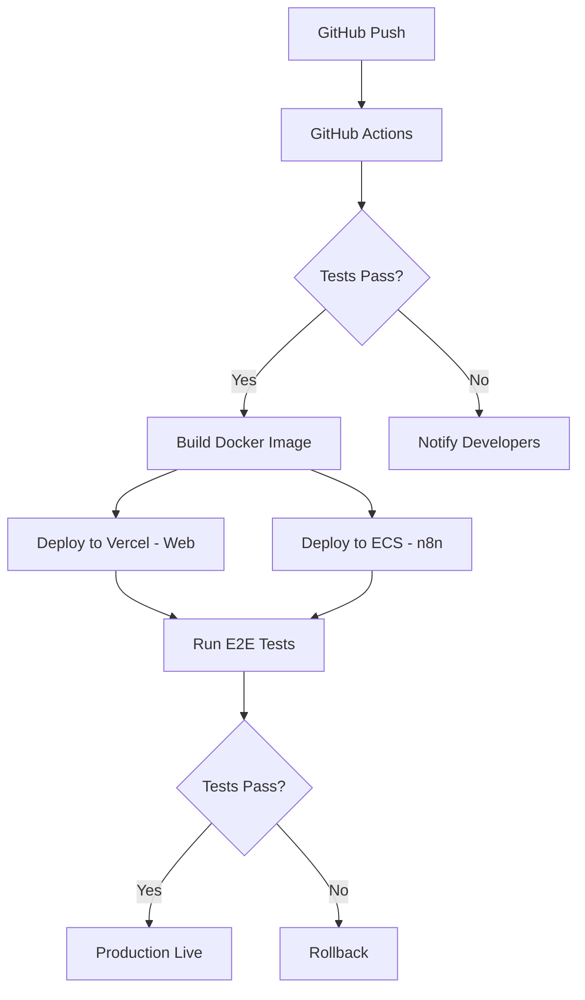

---

## System Architecture Overview

### High-Level Architecture

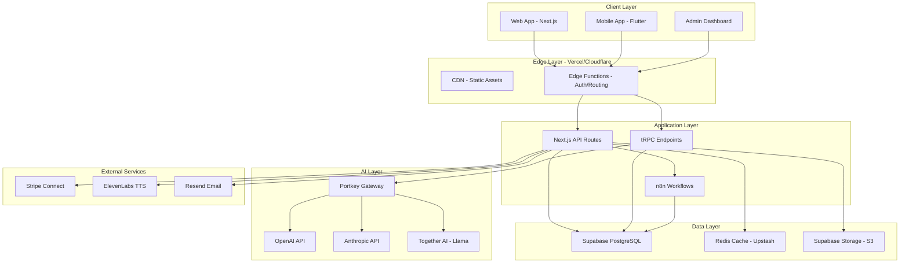

### Data Flow - Student Takes Course

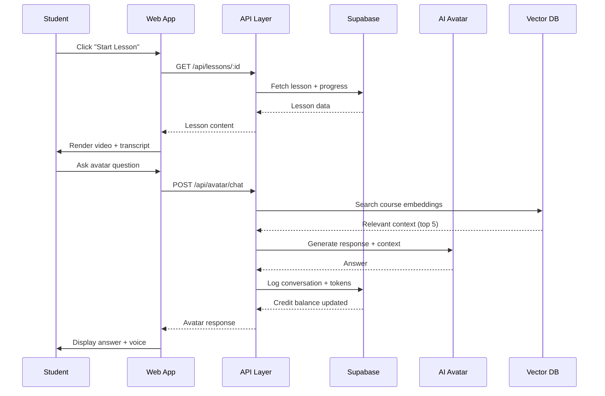

---

## Feature 1: Instructor Course Creation Platform

### Overview

A full-featured course builder that enables ANY instructor to create professional courses without technical skills, while maintaining quality standards and handling payments automatically.

### User Journey - Becoming an Instructor

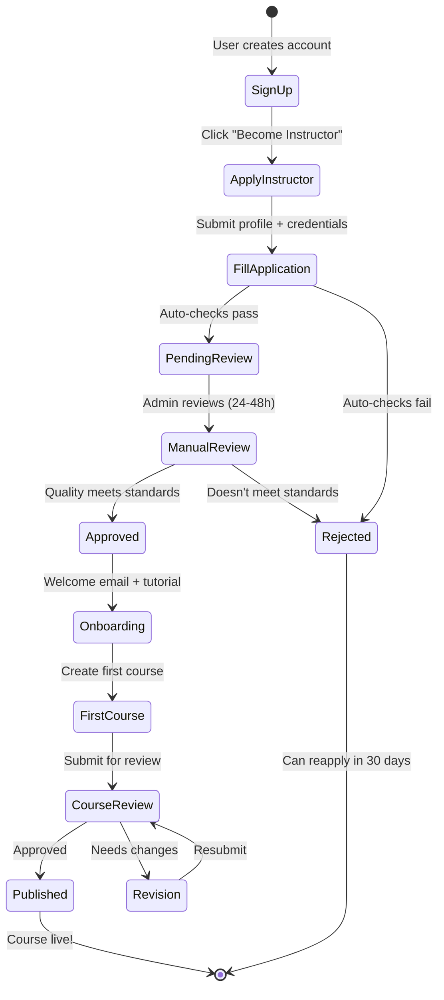

### Instructor Application Process

**Auto-Approval Criteria:**
- Email verified
- LinkedIn/professional profile provided
- No flagged payment history
- Agrees to content policies

**Manual Review Triggers:**
- First-time creator (no teaching history)
- Sensitive topics (finance, medical, legal)
- High pricing (>$500/course)
- Requests custom branding

**Review SLA:** 24 hours (business days), 48 hours max

**Rejection Reasons:**
- Incomplete application
- Inappropriate content history
- Violation of terms of service
- Duplicate account

### Instructor Dashboard

**Layout Structure:**

```
┌─────────────────────────────────────────────────────────────┐
│  Nexus AI Academy - Instructor Dashboard         [Profile ▼]│
├──────────┬──────────────────────────────────────────────────┤
│          │  Overview                                         │
│  📊 Home │  ┌──────────┬──────────┬──────────┬──────────┐   │
│  📚 Courses│ Revenue   │ Students │ Avg Rating│ AI Credits│   │
│  👥 Students│ $2,847   │  342     │  4.8 ⭐   │  8,420   │   │
│  💰 Revenue│ └──────────┴──────────┴──────────┴──────────┘   │
│  📈 Analytics│                                               │
│  ⚙️ Settings│ Recent Activity                               │
│  🤖 AI Config│ ├─ "Web Dev 101" - 12 new enrollments        │
│          │  ├─ "Python Basics" - 4.9★ review from Sarah    │
│          │  └─ AI Avatar used 340 tokens (28 conversations)│
│          │                                                   │
│          │  Quick Actions                                   │
│          │  [+ Create New Course]  [View Payouts]           │
└──────────┴──────────────────────────────────────────────────┘
```

### Course Builder Flow

**Step-by-Step Creation:**

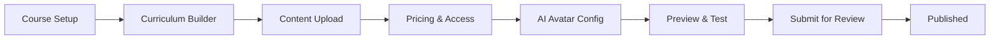

**1. Course Setup (2 min)**
- Title, subtitle, description
- Category & subcategory (dropdown tree)
- Difficulty level (Beginner/Intermediate/Advanced)
- Language (primary + subtitles)
- Cover image (16:9, min 1280×720, AI suggestions available)
- Learning objectives (bullet points, AI can expand)

**2. Curriculum Builder (10-30 min)**
- Drag-and-drop modules/sections
- Add lessons within modules
- Reorder with visual feedback
- Set prerequisites (unlock logic)
- Estimated duration per lesson
- Quiz placement (after module/lesson)

**Interface:**
```
Module 1: Introduction to Python
  ├─ Lesson 1.1: What is Python? (Video - 8 min)
  ├─ Lesson 1.2: Installing Python (Video - 12 min)
  └─ Quiz 1: Python Basics (5 questions)
  
[+ Add Lesson] [+ Add Quiz] [+ Add Module]
```

**3. Content Upload (varies)**

**Supported Content Types:**

| Type | Format | Max Size | Features |
|------|--------|----------|----------|
| **Video** | MP4, MOV, AVI | 5GB | Auto-transcription, chapters, quality conversion (1080p/720p/480p) |
| **Audio** | MP3, WAV | 500MB | Waveform visualization, playback speed control |
| **Document** | PDF, DOCX, PPTX | 100MB | Preview, download, version tracking |
| **Code Exercise** | JS, Python, Java, etc. | 10MB | Monaco editor, auto-tests, hints |
| **Text/Markdown** | Rich text editor | N/A | Images, code blocks, LaTeX math |
| **Quiz** | Multiple choice, true/false, short answer | N/A | Auto-grading, explanation feedback |
| **Assignment** | Upload submission | 50MB | Peer/instructor review, rubrics |
| **Live Session** | Zoom/Google Meet link | N/A | Calendar integration, reminders |

**Upload Features:**
- Resumable uploads (pause/resume large videos)
- Batch upload (select multiple files)
- Cloud import (Google Drive, Dropbox)
- Progress indicator with ETA
- Auto-save drafts every 30s
- Version history (rollback changes)

**Video Processing Pipeline:**


**4. Pricing & Access (3 min)**

**Pricing Models:**
- **Free** - Lead magnet, portfolio piece
- **One-Time Payment** - $9 to $999 (suggested range)
- **Subscription** - Monthly ($4.99-$99/mo) or Annual (20% discount auto-applied)
- **Payment Plan** - Split into 2-6 installments (Stripe handles)
- **Tiered Access** - Basic (free) → Premium (paid) → VIP (coaching)

**Access Control:**
- Lifetime access vs. time-limited (30/90/365 days)
- Drip content (release 1 module/week)
- Enrollment limits (scarcity tactic, max 500 students)
- Coupon codes (% off, fixed amount, free access)
- Bundles (package with other courses, cross-sell)

**5. AI Avatar Configuration (5 min)**

- **Avatar Name** - e.g., "Professor Python", "Coach Sarah"
- **Personality** - Friendly/Professional/Humorous/Strict (slider)
- **Teaching Style** - Socratic/Direct/Encouraging/Challenging
- **Voice** - Choose from 50+ ElevenLabs voices (preview)
- **Language** - Primary + fallback languages
- **Behavior Settings:**
  - Can quiz students? (Yes/No)
  - Can give hints vs. answers? (Hints Only/Both)
  - Response length (Concise/Detailed/Adaptive)
  - Formality level (Casual/Professional)

**6. Preview & Test (5 min)**
- Student view simulation
- Test AI avatar (free credits)
- Check video playback
- Review quiz flow
- Mobile preview (responsive check)

**7. Submit for Review (instant)**
- **Auto-checks:**
  - At least 30 min total content
  - All videos processed successfully
  - Pricing set (if not free)
  - Cover image uploaded
  - At least 3 learning objectives
- **Manual review:** First course only OR flagged topics
- **Review time:** 6-24 hours
- **Notification:** Email + dashboard alert

### Course Review System

**Quality Standards:**
- Video/audio quality (no extreme distortion)
- Content matches description
- No prohibited content (copyrighted material, hate speech, scams)
- Accurate categorization
- Professional presentation

**Review Workflow:**
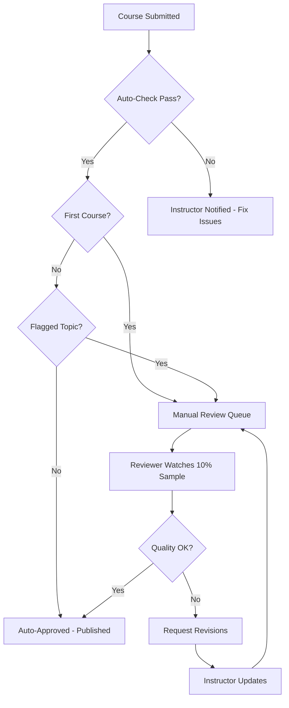

**Reviewer Checklist:**
- [ ] Content matches title/description
- [ ] Video quality meets minimum standards
- [ ] Audio is clear and understandable
- [ ] No copyright violations (visual scan)
- [ ] Appropriate for listed audience
- [ ] Pricing is reasonable for content

**Rejection Reasons & Fixes:**
- Poor audio → Re-record or use noise reduction
- Off-topic → Update description or refocus content
- Too short → Add more lessons or adjust pricing
- Copyright issues → Replace with original/licensed content

### Revenue Share Model

**Standard Split:**
- **70% Instructor** - Direct to their Stripe Connect account
- **30% Platform** - Covers infrastructure, support, payment processing

**Volume Bonuses:**
- Lifetime sales $0-$10k: 70% instructor
- Lifetime sales $10k-$50k: 75% instructor
- Lifetime sales $50k+: 80% instructor

**Payout Schedule:**
- Minimum balance: $50
- Frequency: Monthly (NET-7, paid 7 days after month end)
- Method: Stripe Connect (direct deposit, debit card, PayPal)
- 1099 generation (US instructors, automatic)

**Transaction Flow:**
```
Student pays $100 for course
  ├─ Stripe fee: $3.20 (2.9% + $0.30)
  ├─ Platform cut: $29.04 (30% of $96.80 net)
  └─ Instructor receives: $67.76 (70%)
  
Payout to instructor:
  Day 0: Sale completed
  Day 14: Refund window closes
  Day 21: Payout initiated
  Day 23: Funds in bank account
```

**Refund Policy:**
- 14-day money-back guarantee
- Refunds deducted from next payout
- Instructor can extend refund window (30/60/90 days)
- Abuse protection (>3 refunds = account review)

### Content Types Deep Dive

**Code Exercises:**
```javascript
// Student sees this in Monaco editor
function calculateSum(a, b) {
  // TODO: Implement this function
  return 0;
}

// Hidden test cases (instructor-defined)
test('adds positive numbers', () => {
  expect(calculateSum(2, 3)).toBe(5);
});

test('handles negative numbers', () => {
  expect(calculateSum(-1, 1)).toBe(0);
});
```

**Features:**
- In-browser execution (sandboxed WebAssembly)
- Supported languages: JavaScript, Python, Java, C++, Go, Rust
- Auto-tests with instant feedback
- Hints system (reveal progressively)
- Solution video (unlocks after 3 attempts)

**Quizzes:**
- **Multiple Choice** - Single or multiple correct answers
- **True/False** - Simple boolean
- **Fill in the Blank** - Text matching (exact or fuzzy)
- **Code Output** - Predict what code prints
- **Ordering** - Drag items into correct sequence
- **Matching** - Connect pairs (e.g., term to definition)

**Quiz Settings:**
- Passing score (50%-100%, default 70%)
- Attempts allowed (1/3/unlimited)
- Time limit (optional, 1-60 min)
- Randomize questions (prevent cheating)
- Show correct answers (immediately/after passing/never)
- Certificate eligibility (if quiz is final exam)

### Instructor Onboarding

**Welcome Sequence (n8n automation):**

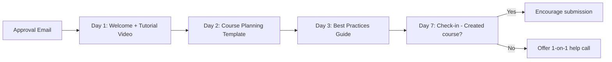

**Onboarding Resources:**
1. **Video Tutorial** (15 min) - Walkthrough of course creation
2. **Course Planning Template** - Google Doc checklist
3. **Best Practices Guide** - Lighting, audio, structuring content
4. **Instructor Community** - Discord/Slack channel for peer support
5. **Office Hours** - Weekly live Q&A with platform team

**First Course Success Program:**
- Dedicated Slack channel for new instructors
- Featured on homepage ("New Courses" section)
- Cross-promotion in newsletter (if meets quality bar)
- $500 bonus if first course reaches 100 students in 90 days

---

## Feature 2: API Billing & Credit System

### Overview

A transparent, flexible credit system that allows instructors to monetize AI features while giving students predictable costs. The system supports three models: platform credits, bring-your-own-key (BYOK), and student-pays.

### Credit Economy Design

**1 Credit = 1,000 tokens (input + output combined)**

**Why this ratio?**
- Simple mental math ($10 = 10,000 tokens ≈ 20-40 AI conversations)
- Aligns with OpenAI pricing (~$0.01 per 1k tokens for GPT-4o-mini)
- Platform markup built into bundle pricing, not per-token

### Credit Pricing Tiers

| Package | Credits | Price | Bonus | Effective Cost per 1k Tokens | Use Case |
|---------|---------|-------|-------|------------------------------|----------|
| **Starter** | 10,000 | $10 | 0% | $0.0100 | Testing AI features |
| **Pro** | 60,000 | $50 | 20% | $0.0083 | 1-2 courses with AI avatars |
| **Business** | 150,000 | $100 | 50% | $0.0067 | 5+ courses, heavy AI usage |
| **Enterprise** | 500,000 | $250 | 100% | $0.0050 | Schools, organizations |

**Volume Discounts (Auto-Applied):**
- Lifetime purchases > $500: +5% bonus credits
- Lifetime purchases > $2,000: +10% bonus credits
- Referral credits: 10% of referee's first purchase

### Model Pricing (Cost per 1k Tokens)

| Model | Input Tokens | Output Tokens | Credits Deducted | Use Case |
|-------|--------------|---------------|------------------|----------|
| **GPT-4o-mini** | 1,000 | 1,000 | 1 | Fast responses, simple Q&A |
| **GPT-4o** | 1,000 | 1,000 | 3 | Detailed explanations, code review |
| **Claude 3.5 Sonnet** | 1,000 | 1,000 | 3 | Creative writing, essay feedback |
| **Claude 3 Opus** | 1,000 | 1,000 | 8 | Complex reasoning, advanced tutoring |
| **Llama 3 70B** | 1,000 | 1,000 | 0.5 | Budget-friendly, bulk Q&A |
| **Whisper (STT)** | 1 minute | N/A | 0.6 | Voice input transcription |
| **ElevenLabs (TTS)** | 1,000 chars | N/A | 1.5 | Voice output generation |

**Why these rates?**
- **Platform markup:** ~40% above actual API costs (to cover infrastructure, failed requests, abuse)
- **Simplified billing:** Avoids micro-transactions (<$0.01)
- **Predictable costs:** Students know exactly what features cost

### Three Credit Models

#### Model 1: Platform Credits (Default)

**How it works:**
- Instructor buys credits from platform
- Credits are stored in instructor's account
- When students use AI features, instructor's balance is deducted
- Instructor sets a budget per course ($10/month, $50/month, unlimited)

**Pros:**
- Simple setup (no API keys needed)
- Platform handles all API management
- Works immediately

**Cons:**
- Instructor pays for student usage
- Can get expensive if students abuse system

**Best for:** Small courses, free courses with AI upsell, instructors who want full control

**Budget Controls:**
```
Course: "Web Development Bootcamp"
Monthly AI Budget: $50 (50,000 credits)

Usage this month: 38,420 credits ($38.42)
  ├─ GPT-4o conversations: 32,000 credits
  ├─ Code generation: 5,200 credits
  └─ Voice responses: 1,220 credits

Alert at 80%: Email sent at 40,000 credits
Action at 100%: AI features disabled, students notified
```

#### Model 2: Bring Your Own Key (BYOK)

**How it works:**
- Instructor provides their own OpenAI/Anthropic API keys
- Platform proxies requests through instructor's keys
- Instructor is billed directly by AI provider
- Platform charges small processing fee (10% of usage or $5/month minimum)

**Pros:**
- Instructor gets wholesale pricing
- No credit purchases needed
- Full transparency (see raw API bills)

**Cons:**
- Requires API key management
- Need to monitor multiple billing sources
- Potential security risk if key leaks

**Best for:** High-volume courses, technical instructors, cost-conscious creators

**Setup Flow:**
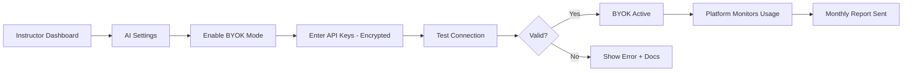

**Security Measures:**
- Keys encrypted at rest (AES-256)
- Keys never logged or exposed in responses
- Automatic key rotation support
- Revocation on suspicious activity
- Request rate limiting (prevent abuse)

#### Model 3: Student-Pays Model

**How it works:**
- Students buy their own credits
- Each student has a personal credit balance
- Instructor's AI features are "free" but require student credits
- Instructor sets credit-cost transparency (e.g., "This avatar costs ~50 credits/hour")

**Pros:**
- Zero cost to instructor
- Students control their spending
- Encourages efficient AI usage

**Cons:**
- Friction in student experience (must buy credits first)
- May reduce engagement if students run out
- Harder to market ("Course is $99 + $10 in credits")

**Best for:** Advanced courses, B2B training, courses with optional AI features

**Student UX:**
```
┌─────────────────────────────────────────────┐
│  ⚠️ Low Credit Warning                      │
│  You have 420 credits remaining (~8 more    │
│  AI conversations). Refill now to continue? │
│  [Buy 10,000 Credits - $10] [Later]         │
└─────────────────────────────────────────────┘
```

### Billing Dashboard Design

**Instructor View:**

```
┌────────────────────────────────────────────────────────────┐
│  💰 AI Credits & Billing                                   │
├────────────────────────────────────────────────────────────┤
│  Current Balance: 42,830 credits ($42.83 value)            │
│  [+ Buy Credits]                                           │
│                                                            │
│  Usage This Month (Feb 2026)                               │
│  ████████████░░░░░░░  18,420 credits used / 50,000 budget  │
│  12 days remaining • Projected: $31.50 total               │
│                                                            │
│  Breakdown by Course:                                      │
│  📚 Web Dev 101          12,340 credits  (67%)            │
│  📚 Python Basics         4,820 credits  (26%)            │
│  📚 AI Fundamentals       1,260 credits  ( 7%)            │
│                                                            │
│  Breakdown by Feature:                                     │
│  🤖 AI Avatar Chats      14,200 credits  (77%)            │
│  💻 Code Generation       3,100 credits  (17%)            │
│  🎤 Voice Responses       1,120 credits  ( 6%)            │
│                                                            │
│  Recent Transactions                                       │
│  Feb 14  Purchase        +50,000 credits  $50.00          │
│  Feb 10  Usage            -8,420 credits                   │
│  Feb 3   Purchase        +10,000 credits  $10.00          │
│  Jan 28  Bonus            +1,000 credits  Referral        │
└────────────────────────────────────────────────────────────┘
```

**Student View (if student-pays model):**

```
┌────────────────────────────────────────────────────────────┐
│  🎓 My Learning Credits                                    │
├────────────────────────────────────────────────────────────┤
│  Balance: 3,240 credits                                    │
│  Estimated: 6-12 more AI chat sessions                     │
│  [+ Add Credits]                                           │
│                                                            │
│  Usage Last 7 Days                                         │
│  Feb 16  Web Dev 101 - AI Avatar        -180 credits      │
│  Feb 15  Python Basics - Code Help      -220 credits      │
│  Feb 14  Web Dev 101 - Quiz Generator   -140 credits      │
│  Feb 12  Voice Explanation              -90 credits       │
│                                                            │
│  Average per session: 160 credits                          │
│  Most active course: Web Dev 101 (62% of usage)           │
└────────────────────────────────────────────────────────────┘
```

### Usage Tracking & Alerts

**Alert System (n8n workflow):**

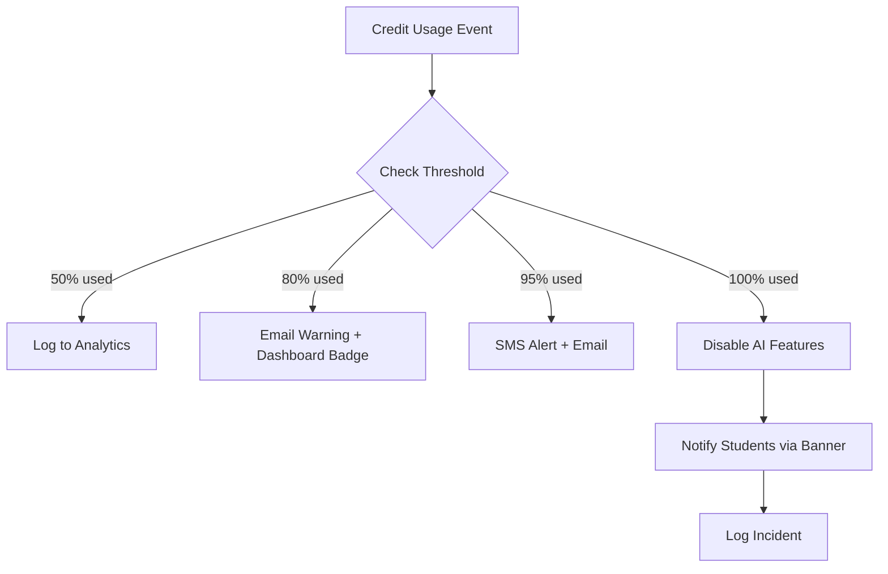

**Alert Examples:**

**80% Warning Email:**
```
Subject: ⚠️ AI Credit Alert - 80% Used

Hi [Instructor],

You've used 40,000 of your 50,000 monthly AI credits for February.

Projected usage: You'll run out in ~3 days at current rate.

Options:
1. Buy more credits (recommended: 50,000 for $50)
2. Reduce AI features temporarily
3. Switch to BYOK mode

View detailed usage: [Dashboard Link]
```

**100% Limit Reached - Student Notification:**
```
Banner on course page:

┌─────────────────────────────────────────────────────────┐
│  ℹ️ AI features temporarily unavailable                 │
│  The course creator's AI credit budget has been reached │
│  for this month. Features will resume March 1st.        │
│  All other course content remains accessible.           │
└─────────────────────────────────────────────────────────┘
```

### Anti-Abuse Measures

**Rate Limiting (per student):**
- 100 AI requests per hour (blocks spam)
- 1,000 tokens max per request (prevents novel-length prompts)
- 50 requests per minute (API flood protection)
- 10 voice generations per hour (TTS abuse prevention)

**Abuse Detection Patterns:**
```sql
-- Flag suspicious usage
SELECT user_id, COUNT(*) as request_count, SUM(tokens_used) as total_tokens
FROM ai_usage_logs
WHERE created_at > NOW() - INTERVAL '1 hour'
GROUP BY user_id
HAVING request_count > 100 OR total_tokens > 50000;

-- Repeated identical prompts (copy-paste spam)
SELECT user_id, prompt_hash, COUNT(*) as repeat_count
FROM ai_usage_logs
WHERE created_at > NOW() - INTERVAL '1 day'
GROUP BY user_id, prompt_hash
HAVING repeat_count > 20;
```

**Automated Actions:**
- 3x rate limit violations → 1-hour cooldown
- Identical prompts >20x → Flag for manual review
- Unusual token spikes (10x average) → Require CAPTCHA
- Repeated abuse → Account suspension

### Revenue Model for Platform

**Credit Sales Markup:**
- Actual API costs: ~$0.007 per 1k tokens (blended rate)
- Sell at: $0.010 per 1k tokens (43% gross margin)
- Volume bonus costs platform 10-15% margin
- **Net margin target: 25-30%**

**BYOK Processing Fee:**
- 10% of usage OR $5/month minimum
- Example: Instructor uses $100 in APIs → Platform earns $10
- Covers: Infrastructure, monitoring, abuse prevention, support

**Projected Revenue (1,000 active instructors):**
```
Scenario 1: 70% platform credits, 30% BYOK

Platform Credit Sales:
  700 instructors × $75 avg spend/month = $52,500
  Gross margin (30%): $15,750

BYOK Fees:
  300 instructors × $150 avg usage × 10% = $4,500

Total Monthly Revenue: $20,250
Annual Run Rate: $243,000
```

### Stripe Integration Architecture

**Payment Flow:**

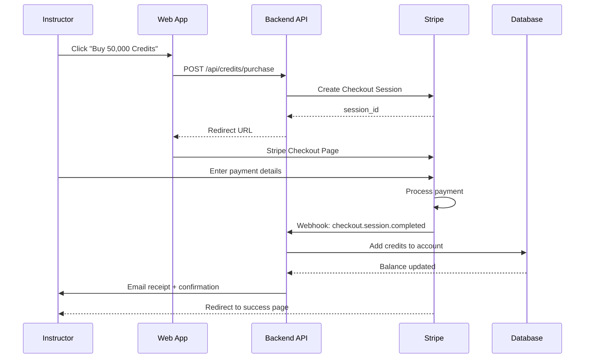

**Webhook Handlers:**

```typescript
// /api/webhooks/stripe
export async function POST(req: Request) {
  const signature = req.headers.get('stripe-signature');
  const event = stripe.webhooks.constructEvent(
    await req.text(),
    signature,
    process.env.STRIPE_WEBHOOK_SECRET
  );

  switch (event.type) {
    case 'checkout.session.completed':
      const session = event.data.object;
      await addCreditsToAccount({
        userId: session.metadata.userId,
        credits: parseInt(session.metadata.credits),
        amountPaid: session.amount_total / 100,
        transactionId: session.id
      });
      break;

    case 'invoice.payment_failed':
      // Handle subscription payment failure
      await notifyPaymentFailure(event.data.object);
      break;

    case 'customer.subscription.deleted':
      // Handle subscription cancellation
      await handleSubscriptionCancellation(event.data.object);
      break;
  }

  return new Response(JSON.stringify({ received: true }), { status: 200 });
}
```

### Database Schema - Billing

```sql
-- Credits account (one per user)
CREATE TABLE credit_accounts (
  id UUID PRIMARY KEY DEFAULT gen_random_uuid(),
  user_id UUID NOT NULL REFERENCES users(id),
  balance INTEGER NOT NULL DEFAULT 0, -- Current credits
  lifetime_purchased INTEGER DEFAULT 0, -- For volume bonuses
  created_at TIMESTAMPTZ DEFAULT NOW(),
  updated_at TIMESTAMPTZ DEFAULT NOW(),
  UNIQUE(user_id)
);

-- Credit transactions (all purchases and deductions)
CREATE TABLE credit_transactions (
  id UUID PRIMARY KEY DEFAULT gen_random_uuid(),
  account_id UUID NOT NULL REFERENCES credit_accounts(id),
  type VARCHAR(20) NOT NULL, -- 'purchase', 'usage', 'bonus', 'refund'
  amount INTEGER NOT NULL, -- Positive for credits added, negative for deductions
  balance_after INTEGER NOT NULL,
  metadata JSONB, -- { credits_package, stripe_session_id, etc. }
  created_at TIMESTAMPTZ DEFAULT NOW()
);

-- AI usage logs (for analytics and billing)
CREATE TABLE ai_usage_logs (
  id UUID PRIMARY KEY DEFAULT gen_random_uuid(),
  user_id UUID NOT NULL REFERENCES users(id),
  course_id UUID REFERENCES courses(id),
  feature_type VARCHAR(50) NOT NULL, -- 'avatar_chat', 'code_gen', 'voice', 'quiz_gen'
  model_used VARCHAR(50) NOT NULL, -- 'gpt-4o', 'claude-3-sonnet', etc.
  tokens_input INTEGER NOT NULL,
  tokens_output INTEGER NOT NULL,
  credits_charged INTEGER NOT NULL,
  prompt_hash VARCHAR(64), -- SHA256 for abuse detection
  cost_usd DECIMAL(10, 6), -- Actual API cost (for BYOK tracking)
  created_at TIMESTAMPTZ DEFAULT NOW(),
  
  -- Indexes for fast queries
  INDEX idx_usage_user_date (user_id, created_at DESC),
  INDEX idx_usage_course_date (course_id, created_at DESC),
  INDEX idx_usage_abuse (user_id, prompt_hash, created_at)
);

-- Budget limits (per course or instructor-wide)
CREATE TABLE credit_budgets (
  id UUID PRIMARY KEY DEFAULT gen_random_uuid(),
  instructor_id UUID NOT NULL REFERENCES users(id),
  course_id UUID REFERENCES courses(id), -- NULL = account-wide budget
  budget_type VARCHAR(20) NOT NULL, -- 'monthly', 'weekly', 'per_student'
  limit_credits INTEGER NOT NULL,
  period_start TIMESTAMPTZ NOT NULL,
  period_end TIMESTAMPTZ NOT NULL,
  current_usage INTEGER DEFAULT 0,
  alert_threshold DECIMAL(3, 2) DEFAULT 0.80, -- Alert at 80%
  created_at TIMESTAMPTZ DEFAULT NOW(),
  updated_at TIMESTAMPTZ DEFAULT NOW()
);

-- API keys (for BYOK mode)
CREATE TABLE api_keys_encrypted (
  id UUID PRIMARY KEY DEFAULT gen_random_uuid(),
  instructor_id UUID NOT NULL REFERENCES users(id),
  provider VARCHAR(20) NOT NULL, -- 'openai', 'anthropic', 'together'
  key_encrypted TEXT NOT NULL, -- AES-256 encrypted
  key_hash VARCHAR(64) NOT NULL, -- For validation without decryption
  status VARCHAR(20) DEFAULT 'active', -- 'active', 'revoked', 'expired'
  last_validated_at TIMESTAMPTZ,
  created_at TIMESTAMPTZ DEFAULT NOW(),
  
  UNIQUE(instructor_id, provider)
);
```

---

## Feature 3: AI Course Avatars (Chat Tutors)

### Overview

Every course gets a personalized AI tutor that knows ONLY the course content, providing students with 24/7 support while tracking learning progress and adapting to individual needs.

### RAG Architecture

**Knowledge Pipeline:**

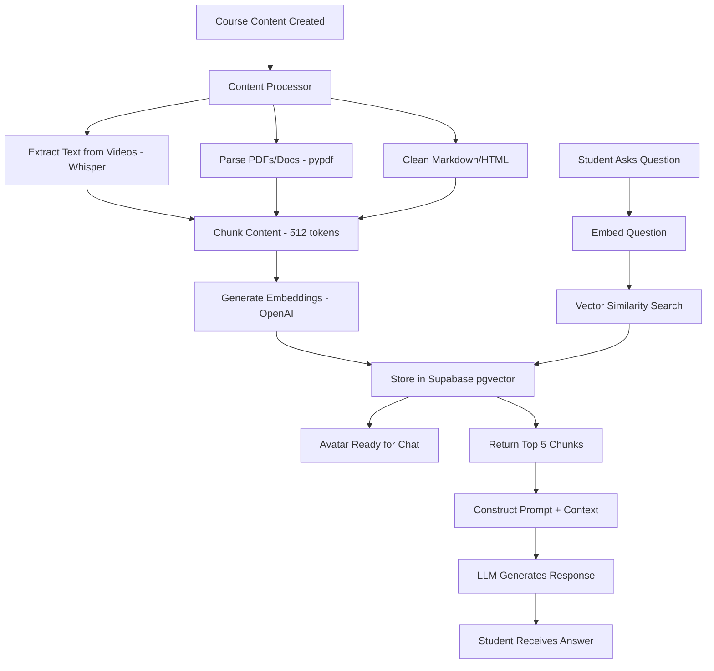

### Vector Database Implementation

**Why Supabase pgvector?**
- **Single database:** No separate vector DB to manage
- **Cost-effective:** Included with Supabase, no per-query pricing
- **Fast:** <10ms similarity search for 100k vectors
- **Postgres native:** Can join with course tables easily
- **Auto-scaling:** Handles growth without reconfiguration

**Schema:**

```sql
-- Enable pgvector extension
CREATE EXTENSION IF NOT EXISTS vector;

-- Course content embeddings
CREATE TABLE course_embeddings (
  id UUID PRIMARY KEY DEFAULT gen_random_uuid(),
  course_id UUID NOT NULL REFERENCES courses(id) ON DELETE CASCADE,
  lesson_id UUID REFERENCES lessons(id) ON DELETE CASCADE,
  content_type VARCHAR(20) NOT NULL, -- 'video_transcript', 'pdf', 'text', 'code'
  chunk_text TEXT NOT NULL, -- Original text chunk (512 tokens)
  chunk_index INTEGER NOT NULL, -- Order within content
  embedding vector(1536) NOT NULL, -- OpenAI embedding dimension
  metadata JSONB, -- { timestamp: "00:05:32", page: 12, section: "Introduction" }
  created_at TIMESTAMPTZ DEFAULT NOW(),
  
  -- Vector similarity index (HNSW for fast search)
  INDEX idx_course_embedding USING hnsw (embedding vector_cosine_ops)
);

-- Avatar configurations
CREATE TABLE avatar_configs (
  id UUID PRIMARY KEY DEFAULT gen_random_uuid(),
  course_id UUID NOT NULL REFERENCES courses(id) ON DELETE CASCADE,
  name VARCHAR(100) NOT NULL DEFAULT 'Course Assistant',
  personality VARCHAR(50) DEFAULT 'friendly', -- 'friendly', 'professional', 'humorous', 'strict'
  teaching_style VARCHAR(50) DEFAULT 'socratic', -- 'socratic', 'direct', 'encouraging', 'challenging'
  voice_id VARCHAR(100), -- ElevenLabs voice ID
  language VARCHAR(10) DEFAULT 'en', -- ISO 639-1 code
  can_quiz BOOLEAN DEFAULT true,
  can_give_answers BOOLEAN DEFAULT false, -- If false, only hints
  response_length VARCHAR(20) DEFAULT 'adaptive', -- 'concise', 'detailed', 'adaptive'
  system_prompt TEXT, -- Custom instructor override
  enabled BOOLEAN DEFAULT true,
  created_at TIMESTAMPTZ DEFAULT NOW(),
  updated_at TIMESTAMPTZ DEFAULT NOW(),
  
  UNIQUE(course_id)
);

-- Student conversations
CREATE TABLE avatar_conversations (
  id UUID PRIMARY KEY DEFAULT gen_random_uuid(),
  student_id UUID NOT NULL REFERENCES users(id),
  course_id UUID NOT NULL REFERENCES courses(id),
  lesson_id UUID REFERENCES lessons(id), -- Which lesson they were on
  started_at TIMESTAMPTZ DEFAULT NOW(),
  last_message_at TIMESTAMPTZ DEFAULT NOW(),
  message_count INTEGER DEFAULT 0,
  total_tokens INTEGER DEFAULT 0,
  
  INDEX idx_conversations_student (student_id, last_message_at DESC)
);

-- Individual messages
CREATE TABLE avatar_messages (
  id UUID PRIMARY KEY DEFAULT gen_random_uuid(),
  conversation_id UUID NOT NULL REFERENCES avatar_conversations(id) ON DELETE CASCADE,
  role VARCHAR(10) NOT NULL, -- 'user' or 'assistant'
  content TEXT NOT NULL,
  tokens_used INTEGER,
  model_used VARCHAR(50),
  context_chunks UUID[], -- Which embeddings were used for this response
  created_at TIMESTAMPTZ DEFAULT NOW(),
  
  INDEX idx_messages_conversation (conversation_id, created_at)
);

-- Learning analytics (what student struggles with)
CREATE TABLE learning_signals (
  id UUID PRIMARY KEY DEFAULT gen_random_uuid(),
  student_id UUID NOT NULL REFERENCES users(id),
  course_id UUID NOT NULL REFERENCES courses(id),
  topic_keywords TEXT[], -- Extracted from repeated questions
  confusion_score DECIMAL(3, 2), -- 0-1, based on question frequency
  mastery_score DECIMAL(3, 2), -- 0-1, based on quiz performance
  last_asked TIMESTAMPTZ,
  times_asked INTEGER DEFAULT 1,
  
  UNIQUE(student_id, course_id, topic_keywords)
);
```

### Content Chunking Strategy

**Optimal chunk size: 512 tokens (~400 words)**

**Why?**
- Fits in LLM context without waste
- Preserves semantic meaning (whole paragraphs)
- Fast embedding generation (<100ms)
- Balances specificity vs. context

**Chunking Logic:**

```python
def chunk_content(text: str, chunk_size: int = 512, overlap: int = 64) -> List[str]:
    """
    Split text into overlapping chunks for better context preservation.
    Overlap ensures concepts spanning boundaries aren't lost.
    """
    tokens = tokenizer.encode(text)
    chunks = []
    
    for i in range(0, len(tokens), chunk_size - overlap):
        chunk_tokens = tokens[i:i + chunk_size]
        chunks.append(tokenizer.decode(chunk_tokens))
    
    return chunks

# Video transcript example
transcript = get_video_transcript(video_id)
chunks = chunk_content(transcript, chunk_size=512, overlap=64)

for idx, chunk in enumerate(chunks):
    embedding = openai.embeddings.create(
        model="text-embedding-3-small",
        input=chunk
    ).data[0].embedding
    
    supabase.table('course_embeddings').insert({
        'course_id': course_id,
        'lesson_id': lesson_id,
        'content_type': 'video_transcript',
        'chunk_text': chunk,
        'chunk_index': idx,
        'embedding': embedding,
        'metadata': {
            'timestamp': calculate_timestamp(idx, video_duration),
            'video_title': video.title
        }
    }).execute()
```

### Vector Search Implementation

**Query Flow:**

```typescript
async function getRelevantContext(
  courseId: string,
  question: string,
  topK: number = 5
): Promise<ContextChunk[]> {
  // 1. Embed the student's question
  const questionEmbedding = await openai.embeddings.create({
    model: "text-embedding-3-small",
    input: question
  });

  // 2. Perform similarity search
  const { data, error } = await supabase.rpc('match_course_embeddings', {
    course_id: courseId,
    query_embedding: questionEmbedding.data[0].embedding,
    match_count: topK,
    match_threshold: 0.7 // Only return if >70% similarity
  });

  // 3. Re-rank by content type priority (code examples > text > transcripts)
  const reranked = data.sort((a, b) => {
    const typePriority = { 'code': 3, 'text': 2, 'video_transcript': 1 };
    return (typePriority[b.content_type] || 0) - (typePriority[a.content_type] || 0);
  });

  return reranked.slice(0, topK);
}

// PostgreSQL function for vector search
CREATE OR REPLACE FUNCTION match_course_embeddings(
  course_id UUID,
  query_embedding vector(1536),
  match_count INT DEFAULT 5,
  match_threshold FLOAT DEFAULT 0.7
)
RETURNS TABLE (
  id UUID,
  course_id UUID,
  chunk_text TEXT,
  content_type VARCHAR,
  metadata JSONB,
  similarity FLOAT
)
LANGUAGE plpgsql
AS $$
BEGIN
  RETURN QUERY
  SELECT
    course_embeddings.id,
    course_embeddings.course_id,
    course_embeddings.chunk_text,
    course_embeddings.content_type,
    course_embeddings.metadata,
    1 - (course_embeddings.embedding <=> query_embedding) AS similarity
  FROM course_embeddings
  WHERE course_embeddings.course_id = match_course_embeddings.course_id
    AND 1 - (course_embeddings.embedding <=> query_embedding) > match_threshold
  ORDER BY similarity DESC
  LIMIT match_count;
END;
$$;
```

### Avatar Personality System

**Personality Matrix:**

| Trait | Friendly | Professional | Humorous | Strict |
|-------|----------|--------------|----------|--------|
| **Greeting** | "Hey there! 😊" | "Hello!" | "Yo! Ready to learn?" | "Welcome, student." |
| **Response Style** | Casual, emojis | Formal, clear | Jokes, puns | Direct, no fluff |
| **When Student Wrong** | "Almost! Let's try..." | "That's incorrect. The answer is..." | "Oops! Nice try though 😅" | "Wrong. Review Section 3." |
| **Encouragement** | "You're doing great!" | "Well done." | "Crushing it! 🔥" | "Adequate progress." |

**Teaching Style Implementation:**

```typescript
const teachingStyles = {
  socratic: {
    systemPrompt: `You guide students with questions rather than direct answers. 
                   Ask leading questions that help them discover the solution.
                   Example: Instead of "The answer is X", ask "What happens if you...?"`,
    giveAnswerImmediately: false,
    hintFirst: true
  },
  
  direct: {
    systemPrompt: `Provide clear, straightforward explanations with examples.
                   Be concise and to-the-point. Structure: Answer → Why → Example.`,
    giveAnswerImmediately: true,
    hintFirst: false
  },
  
  encouraging: {
    systemPrompt: `Be supportive and positive. Celebrate small wins. 
                   Use phrases like "Great question!", "You're on the right track!"
                   Build confidence while teaching.`,
    giveAnswerImmediately: false,
    celebrateProgress: true
  },
  
  challenging: {
    systemPrompt: `Push students to think harder. Ask "Why?" and "What if?".
                   Don't accept surface-level understanding. Demand rigor.`,
    askFollowUpQuestions: true,
    requiredDepth: 'high'
  }
};
```

### Context Window Management

**Challenge:** Keep conversation history + course context within LLM limits (e.g., 128k tokens for GPT-4o)

**Strategy:**

```typescript
async function buildContextWindow(
  conversationId: string,
  question: string,
  courseId: string
) {
  // 1. Get relevant course content (top 5 chunks, ~2500 tokens)
  const courseContext = await getRelevantContext(courseId, question, 5);
  
  // 2. Get recent conversation history (last 10 messages, ~2000 tokens)
  const recentMessages = await getRecentMessages(conversationId, 10);
  
  // 3. Get avatar config for system prompt (~500 tokens)
  const avatarConfig = await getAvatarConfig(courseId);
  
  // 4. Build prompt with token budget management
  const systemPrompt = generateSystemPrompt(avatarConfig);
  const contextSection = formatCourseContext(courseContext);
  const historySection = formatMessageHistory(recentMessages);
  
  // Token budget: 8k total (leaves 120k for response)
  const prompt = {
    system: systemPrompt, // ~500 tokens
    context: contextSection, // ~2500 tokens
    history: historySection, // ~2000 tokens
    question: question // ~100-500 tokens
  };
  
  // Safety check: if over budget, trim history first
  if (estimateTokens(prompt) > 8000) {
    prompt.history = truncateHistory(recentMessages, 1000);
  }
  
  return prompt;
}
```

**Memory Management:**

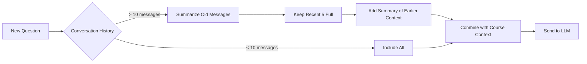

### Chat Interface Design

**Embedded Widget (Course Page):**

```
┌─────────────────────────────────────────────────────────────┐
│  Lesson 3: Variables in Python                [🤖 Ask AI]  │
├─────────────────────────────────────────────────────────────┤
│                                                             │
│  [Video Player - 12:34 / 28:15]                            │
│                                                             │
│  Transcript shown below...                                  │
└─────────────────────────────────────────────────────────────┘

                        [Click 🤖 Ask AI]

┌─────────────────────────────────────────────────────────────┐
│  💬 Chat with Professor Python                    [✕ Close]│
├─────────────────────────────────────────────────────────────┤
│                                                             │
│  🤖 Professor Python                              10:23 AM  │
│  ┌────────────────────────────────────────────────────────┐│
│  │ Hey there! I'm here to help you master this lesson.   ││
│  │ What questions do you have about variables in Python? ││
│  └────────────────────────────────────────────────────────┘│
│                                                             │
│                           You                     10:24 AM  │
│                  ┌───────────────────────────────────────┐ │
│                  │ What's the difference between a       │ │
│                  │ variable and a constant?              │ │
│                  └───────────────────────────────────────┘ │
│                                                             │
│  🤖 Professor Python                              10:24 AM  │
│  ┌────────────────────────────────────────────────────────┐│
│  │ Great question! Let me explain with an example from    ││
│  │ this lesson (timestamp 05:32):                        ││
│  │                                                        ││
│  │ A variable can change: `x = 5` then `x = 10`         ││
│  │ A constant stays the same: `PI = 3.14159`            ││
│  │                                                        ││
│  │ In Python, we indicate constants by using ALL_CAPS.   ││
│  │ Want to try creating both in the code editor below?   ││
│  └────────────────────────────────────────────────────────┘│
│                                  [🔊 Play Voice] [📋 Copy] │
│                                                             │
├─────────────────────────────────────────────────────────────┤
│  Type your question...                     [🎤]      [Send]│
└─────────────────────────────────────────────────────────────┘

Credits used this session: 180 (~3 questions remaining)
```

**Features:**
- **Typing indicator** - Shows when AI is thinking
- **Timestamp links** - Click timestamp to jump to video moment
- **Voice playback** - TTS for accessibility
- **Code highlighting** - Syntax coloring in responses
- **Copy button** - Grab code snippets easily
- **Mobile-optimized** - Full-screen on small devices
- **Keyboard shortcuts** - `Ctrl+K` to open, `Esc` to close

### Avatar Evaluation & Quizzing

**Can the avatar quiz students?**

**Yes, with instructor permission:**

```typescript
// Avatar config setting
const canQuiz = avatarConfig.can_quiz; // true/false

// If enabled, avatar can:
// 1. Detect when student is ready for assessment
// 2. Generate quiz questions based on conversation
// 3. Grade answers (multiple choice, true/false, short answer)
// 4. Provide explanations for wrong answers

// Example conversation:
// Student: "I think I understand variables now"
// Avatar: "Awesome! Want to test your knowledge? I can quiz you on what we just discussed."
// Student: "Sure!"
// Avatar: "Question 1: What happens if you assign `x = 5` then `x = "hello"` in Python?"
//         [Multiple choice buttons]
```

**Grading Logic:**

```typescript
async function gradeStudentAnswer(
  question: string,
  studentAnswer: string,
  correctAnswer: string,
  questionType: 'multiple_choice' | 'short_answer' | 'code'
) {
  if (questionType === 'multiple_choice') {
    return studentAnswer.trim().toLowerCase() === correctAnswer.trim().toLowerCase();
  }
  
  if (questionType === 'code') {
    // Run code tests (sandboxed)
    const testResults = await runCodeTests(studentAnswer);
    return testResults.allPassed;
  }
  
  if (questionType === 'short_answer') {
    // Use LLM to evaluate semantic similarity
    const evaluation = await openai.chat.completions.create({
      model: 'gpt-4o-mini',
      messages: [
        {
          role: 'system',
          content: `You are grading a student's short answer. Evaluate if their answer demonstrates understanding of the concept, even if wording differs from the expected answer.`
        },
        {
          role: 'user',
          content: `Question: ${question}\nExpected: ${correctAnswer}\nStudent wrote: ${studentAnswer}\n\nIs this correct? Reply with CORRECT or INCORRECT, then explain why.`
        }
      ]
    });
    
    return evaluation.choices[0].message.content.startsWith('CORRECT');
  }
}
```

### Memory & Session Persistence

**Does the avatar remember previous sessions?**

**Yes - Multi-level memory:**

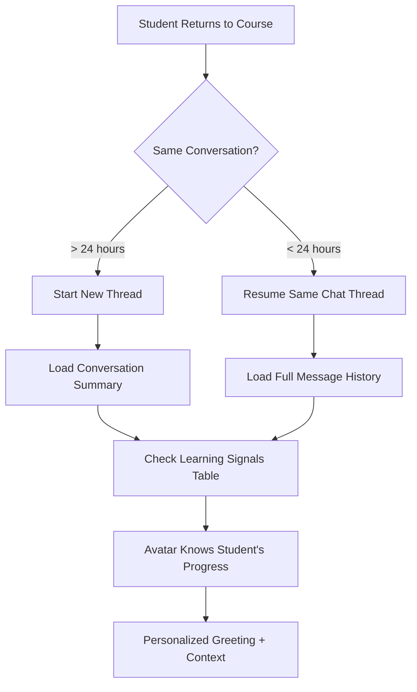

**Memory Types:**

1. **Short-term (Session Memory)** - Last 10-20 messages in conversation
2. **Medium-term (Conversation Summary)** - AI-generated summary of previous chats
3. **Long-term (Learning Signals)** - Topics student struggles with, mastered concepts

**Example Personalized Greeting:**

```
🤖 Welcome back, Sarah! Last time we discussed Python loops and you were 
   working on the `for` loop exercise. I see you completed it — nice work! 
   
   You mentioned being confused about nested loops. Want to dive deeper 
   into that today, or move on to the next lesson?
```

**Implementation:**

```typescript
async function generatePersonalizedGreeting(studentId: string, courseId: string) {
  // Get last conversation summary
  const lastConversation = await supabase
    .from('avatar_conversations')
    .select('*')
    .eq('student_id', studentId)
    .eq('course_id', courseId)
    .order('last_message_at', { ascending: false })
    .limit(1)
    .single();
  
  // Get learning signals (struggle topics)
  const struggles = await supabase
    .from('learning_signals')
    .select('*')
    .eq('student_id', studentId)
    .eq('course_id', courseId)
    .order('confusion_score', { ascending: false })
    .limit(3);
  
  // Get recent lesson progress
  const lastLesson = await supabase
    .from('lesson_progress')
    .select('*, lessons(*)')
    .eq('student_id', studentId)
    .order('last_accessed_at', { ascending: false })
    .limit(1)
    .single();
  
  // Generate contextual greeting with LLM
  const prompt = `
    Student ${studentId} is returning to the course.
    Last conversation: ${lastConversation?.last_message_at} (${lastConversation?.message_count} messages)
    Topics they struggle with: ${struggles.map(s => s.topic_keywords).join(', ')}
    Last lesson: ${lastLesson?.lessons?.title} (${lastLesson?.completion_percentage}% complete)
    
    Write a friendly, personalized greeting (2-3 sentences) that:
    1. Welcomes them back
    2. References their progress
    3. Offers relevant help
  `;
  
  const greeting = await openai.chat.completions.create({
    model: 'gpt-4o-mini',
    messages: [{ role: 'user', content: prompt }]
  });
  
  return greeting.choices[0].message.content;
}
```

### Multi-Language Support

**Supported Languages:**

| Language | Code | ElevenLabs TTS | Auto-Translate Content |
|----------|------|----------------|------------------------|
| English | en | ✅ | N/A (default) |
| Spanish | es | ✅ | ✅ |
| French | fr | ✅ | ✅ |
| German | de | ✅ | ✅ |
| Portuguese | pt | ✅ | ✅ |
| Mandarin | zh | ✅ | ✅ |
| Arabic | ar | ✅ | ✅ |
| Japanese | ja | ✅ | ✅ |
| Korean | ko | ✅ | ✅ |

**Implementation Strategy:**

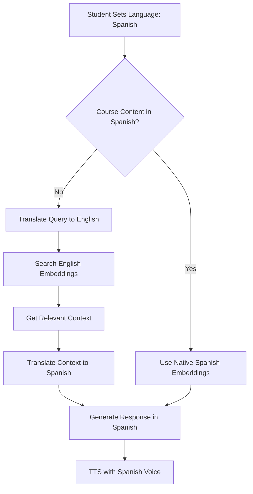

**Code Example:**

```typescript
async function handleMultilingualChat(
  question: string,
  courseId: string,
  userLanguage: string = 'en'
) {
  const courseConfig = await getCourseConfig(courseId);
  const courseLanguage = courseConfig.primary_language;
  
  // If languages match, proceed normally
  if (userLanguage === courseLanguage) {
    const context = await getRelevantContext(courseId, question);
    return generateResponse(question, context, userLanguage);
  }
  
  // Languages differ - translate query first
  const translatedQuery = await translateText(question, userLanguage, courseLanguage);
  const context = await getRelevantContext(courseId, translatedQuery);
  
  // Generate response in course language
  const response = await generateResponse(translatedQuery, context, courseLanguage);
  
  // Translate response back to user's language
  const translatedResponse = await translateText(response, courseLanguage, userLanguage);
  
  return translatedResponse;
}

// Using GPT-4o's native multilingual capabilities
async function translateText(text: string, fromLang: string, toLang: string) {
  const response = await openai.chat.completions.create({
    model: 'gpt-4o-mini',
    messages: [
      {
        role: 'system',
        content: `Translate from ${fromLang} to ${toLang}. Maintain technical accuracy and conversational tone.`
      },
      {
        role: 'user',
        content: text
      }
    ]
  });
  
  return response.choices[0].message.content;
}
```

**Cost Optimization:**
- Cache translations (common questions)
- Batch translation requests
- Use cheaper models for translation (GPT-4o-mini, not Opus)

---

## Database Schema

### Complete Schema Overview

```sql
-- ============================================
-- USERS & AUTHENTICATION
-- ============================================

CREATE TABLE users (
  id UUID PRIMARY KEY DEFAULT gen_random_uuid(),
  email VARCHAR(255) UNIQUE NOT NULL,
  name VARCHAR(255),
  avatar_url TEXT,
  role VARCHAR(20) DEFAULT 'student', -- 'student', 'instructor', 'admin'
  created_at TIMESTAMPTZ DEFAULT NOW(),
  updated_at TIMESTAMPTZ DEFAULT NOW()
);

CREATE TABLE instructor_profiles (
  id UUID PRIMARY KEY DEFAULT gen_random_uuid(),
  user_id UUID NOT NULL REFERENCES users(id) ON DELETE CASCADE,
  bio TEXT,
  expertise TEXT[], -- ['Web Development', 'AI', 'Python']
  social_links JSONB, -- { linkedin: "", twitter: "", website: "" }
  approval_status VARCHAR(20) DEFAULT 'pending', -- 'pending', 'approved', 'rejected'
  approved_at TIMESTAMPTZ,
  approved_by UUID REFERENCES users(id),
  stripe_connect_id VARCHAR(255), -- Stripe Connect account for payouts
  payout_method VARCHAR(50) DEFAULT 'stripe', -- 'stripe', 'paypal'
  created_at TIMESTAMPTZ DEFAULT NOW(),
  updated_at TIMESTAMPTZ DEFAULT NOW(),
  
  UNIQUE(user_id)
);

-- ============================================
-- COURSES & CONTENT
-- ============================================

CREATE TABLE courses (
  id UUID PRIMARY KEY DEFAULT gen_random_uuid(),
  instructor_id UUID NOT NULL REFERENCES users(id),
  title VARCHAR(255) NOT NULL,
  subtitle VARCHAR(500),
  description TEXT,
  category VARCHAR(100),
  subcategory VARCHAR(100),
  difficulty VARCHAR(20), -- 'beginner', 'intermediate', 'advanced'
  language VARCHAR(10) DEFAULT 'en',
  cover_image_url TEXT,
  promo_video_url TEXT,
  learning_objectives TEXT[],
  requirements TEXT[],
  target_audience TEXT[],
  
  -- Pricing
  pricing_model VARCHAR(20) DEFAULT 'free', -- 'free', 'one_time', 'subscription'
  price_usd DECIMAL(10, 2),
  subscription_price_monthly DECIMAL(10, 2),
  subscription_price_annual DECIMAL(10, 2),
  
  -- Status
  status VARCHAR(20) DEFAULT 'draft', -- 'draft', 'pending_review', 'published', 'archived'
  published_at TIMESTAMPTZ,
  
  -- Stats
  enrollment_count INTEGER DEFAULT 0,
  rating_avg DECIMAL(3, 2) DEFAULT 0,
  rating_count INTEGER DEFAULT 0,
  total_duration_minutes INTEGER DEFAULT 0,
  
  -- SEO
  slug VARCHAR(255) UNIQUE,
  meta_description TEXT,
  
  created_at TIMESTAMPTZ DEFAULT NOW(),
  updated_at TIMESTAMPTZ DEFAULT NOW(),
  
  INDEX idx_courses_instructor (instructor_id),
  INDEX idx_courses_status (status, published_at DESC),
  INDEX idx_courses_category (category, subcategory)
);

CREATE TABLE modules (
  id UUID PRIMARY KEY DEFAULT gen_random_uuid(),
  course_id UUID NOT NULL REFERENCES courses(id) ON DELETE CASCADE,
  title VARCHAR(255) NOT NULL,
  description TEXT,
  order_index INTEGER NOT NULL,
  created_at TIMESTAMPTZ DEFAULT NOW(),
  
  UNIQUE(course_id, order_index)
);

CREATE TABLE lessons (
  id UUID PRIMARY KEY DEFAULT gen_random_uuid(),
  module_id UUID NOT NULL REFERENCES modules(id) ON DELETE CASCADE,
  course_id UUID NOT NULL REFERENCES courses(id), -- Denormalized for faster queries
  title VARCHAR(255) NOT NULL,
  description TEXT,
  content_type VARCHAR(20) NOT NULL, -- 'video', 'text', 'pdf', 'code', 'quiz', 'assignment'
  
  -- Content URLs
  video_url TEXT,
  video_duration_seconds INTEGER,
  video_transcript TEXT,
  pdf_url TEXT,
  content_markdown TEXT,
  
  -- Settings
  is_preview BOOLEAN DEFAULT false, -- Can non-enrolled students see this?
  order_index INTEGER NOT NULL,
  estimated_minutes INTEGER,
  
  created_at TIMESTAMPTZ DEFAULT NOW(),
  updated_at TIMESTAMPTZ DEFAULT NOW(),
  
  UNIQUE(module_id, order_index),
  INDEX idx_lessons_course (course_id)
);

CREATE TABLE quizzes (
  id UUID PRIMARY KEY DEFAULT gen_random_uuid(),
  lesson_id UUID REFERENCES lessons(id) ON DELETE CASCADE,
  module_id UUID REFERENCES modules(id) ON DELETE CASCADE, -- Quiz can be lesson-level or module-level
  title VARCHAR(255) NOT NULL,
  description TEXT,
  passing_score INTEGER DEFAULT 70, -- Percentage
  attempts_allowed INTEGER DEFAULT 3, -- 0 = unlimited
  time_limit_minutes INTEGER, -- NULL = no limit
  randomize_questions BOOLEAN DEFAULT false,
  show_correct_answers VARCHAR(20) DEFAULT 'after_passing', -- 'immediately', 'after_passing', 'never'
  created_at TIMESTAMPTZ DEFAULT NOW()
);

CREATE TABLE quiz_questions (
  id UUID PRIMARY KEY DEFAULT gen_random_uuid(),
  quiz_id UUID NOT NULL REFERENCES quizzes(id) ON DELETE CASCADE,
  question_type VARCHAR(20) NOT NULL, -- 'multiple_choice', 'true_false', 'short_answer', 'code'
  question_text TEXT NOT NULL,
  explanation TEXT, -- Shown after answering
  points INTEGER DEFAULT 1,
  order_index INTEGER,
  
  -- For multiple choice
  options JSONB, -- [{ "id": "a", "text": "Option A" }, ...]
  correct_options TEXT[], -- ["a", "c"] for multi-select
  
  -- For short answer / code
  correct_answer TEXT,
  
  created_at TIMESTAMPTZ DEFAULT NOW()
);

-- ============================================
-- ENROLLMENTS & PROGRESS
-- ============================================

CREATE TABLE enrollments (
  id UUID PRIMARY KEY DEFAULT gen_random_uuid(),
  student_id UUID NOT NULL REFERENCES users(id) ON DELETE CASCADE,
  course_id UUID NOT NULL REFERENCES courses(id) ON DELETE CASCADE,
  
  -- Pricing
  amount_paid DECIMAL(10, 2), -- NULL if free
  payment_type VARCHAR(20), -- 'one_time', 'subscription', 'free'
  stripe_payment_id VARCHAR(255),
  
  -- Status
  status VARCHAR(20) DEFAULT 'active', -- 'active', 'completed', 'refunded', 'cancelled'
  enrolled_at TIMESTAMPTZ DEFAULT NOW(),
  completed_at TIMESTAMPTZ,
  last_accessed_at TIMESTAMPTZ,
  
  -- Progress
  completion_percentage INTEGER DEFAULT 0,
  lessons_completed INTEGER DEFAULT 0,
  total_time_spent_minutes INTEGER DEFAULT 0,
  
  UNIQUE(student_id, course_id),
  INDEX idx_enrollments_student (student_id, last_accessed_at DESC)
);

CREATE TABLE lesson_progress (
  id UUID PRIMARY KEY DEFAULT gen_random_uuid(),
  enrollment_id UUID NOT NULL REFERENCES enrollments(id) ON DELETE CASCADE,
  lesson_id UUID NOT NULL REFERENCES lessons(id) ON DELETE CASCADE,
  student_id UUID NOT NULL REFERENCES users(id), -- Denormalized
  
  -- Video progress
  video_position_seconds INTEGER DEFAULT 0,
  watched_percentage INTEGER DEFAULT 0,
  
  -- Status
  completed BOOLEAN DEFAULT false,
  completed_at TIMESTAMPTZ,
  first_viewed_at TIMESTAMPTZ DEFAULT NOW(),
  last_viewed_at TIMESTAMPTZ DEFAULT NOW(),
  
  UNIQUE(enrollment_id, lesson_id),
  INDEX idx_lesson_progress_student (student_id, last_viewed_at DESC)
);

CREATE TABLE quiz_attempts (
  id UUID PRIMARY KEY DEFAULT gen_random_uuid(),
  student_id UUID NOT NULL REFERENCES users(id),
  quiz_id UUID NOT NULL REFERENCES quizzes(id),
  score DECIMAL(5, 2), -- Percentage
  passed BOOLEAN,
  answers JSONB, -- { "question_id": "selected_answer", ... }
  started_at TIMESTAMPTZ DEFAULT NOW(),
  submitted_at TIMESTAMPTZ,
  
  INDEX idx_quiz_attempts_student (student_id, submitted_at DESC)
);

-- ============================================
-- CREDITS & BILLING (from Feature 2)
-- ============================================

CREATE TABLE credit_accounts (
  id UUID PRIMARY KEY DEFAULT gen_random_uuid(),
  user_id UUID NOT NULL REFERENCES users(id),
  balance INTEGER NOT NULL DEFAULT 0,
  lifetime_purchased INTEGER DEFAULT 0,
  created_at TIMESTAMPTZ DEFAULT NOW(),
  updated_at TIMESTAMPTZ DEFAULT NOW(),
  UNIQUE(user_id)
);

CREATE TABLE credit_transactions (
  id UUID PRIMARY KEY DEFAULT gen_random_uuid(),
  account_id UUID NOT NULL REFERENCES credit_accounts(id),
  type VARCHAR(20) NOT NULL,
  amount INTEGER NOT NULL,
  balance_after INTEGER NOT NULL,
  metadata JSONB,
  created_at TIMESTAMPTZ DEFAULT NOW()
);

CREATE TABLE ai_usage_logs (
  id UUID PRIMARY KEY DEFAULT gen_random_uuid(),
  user_id UUID NOT NULL REFERENCES users(id),
  course_id UUID REFERENCES courses(id),
  feature_type VARCHAR(50) NOT NULL,
  model_used VARCHAR(50) NOT NULL,
  tokens_input INTEGER NOT NULL,
  tokens_output INTEGER NOT NULL,
  credits_charged INTEGER NOT NULL,
  prompt_hash VARCHAR(64),
  cost_usd DECIMAL(10, 6),
  created_at TIMESTAMPTZ DEFAULT NOW(),
  
  INDEX idx_usage_user_date (user_id, created_at DESC),
  INDEX idx_usage_course_date (course_id, created_at DESC)
);

-- ============================================
-- AI AVATARS (from Feature 3)
-- ============================================

CREATE EXTENSION IF NOT EXISTS vector;

CREATE TABLE course_embeddings (
  id UUID PRIMARY KEY DEFAULT gen_random_uuid(),
  course_id UUID NOT NULL REFERENCES courses(id) ON DELETE CASCADE,
  lesson_id UUID REFERENCES lessons(id) ON DELETE CASCADE,
  content_type VARCHAR(20) NOT NULL,
  chunk_text TEXT NOT NULL,
  chunk_index INTEGER NOT NULL,
  embedding vector(1536) NOT NULL,
  metadata JSONB,
  created_at TIMESTAMPTZ DEFAULT NOW(),
  
  INDEX idx_course_embedding USING hnsw (embedding vector_cosine_ops)
);

CREATE TABLE avatar_configs (
  id UUID PRIMARY KEY DEFAULT gen_random_uuid(),
  course_id UUID NOT NULL REFERENCES courses(id) ON DELETE CASCADE,
  name VARCHAR(100) NOT NULL DEFAULT 'Course Assistant',
  personality VARCHAR(50) DEFAULT 'friendly',
  teaching_style VARCHAR(50) DEFAULT 'socratic',
  voice_id VARCHAR(100),
  language VARCHAR(10) DEFAULT 'en',
  can_quiz BOOLEAN DEFAULT true,
  can_give_answers BOOLEAN DEFAULT false,
  response_length VARCHAR(20) DEFAULT 'adaptive',
  system_prompt TEXT,
  enabled BOOLEAN DEFAULT true,
  created_at TIMESTAMPTZ DEFAULT NOW(),
  updated_at TIMESTAMPTZ DEFAULT NOW(),
  UNIQUE(course_id)
);

CREATE TABLE avatar_conversations (
  id UUID PRIMARY KEY DEFAULT gen_random_uuid(),
  student_id UUID NOT NULL REFERENCES users(id),
  course_id UUID NOT NULL REFERENCES courses(id),
  lesson_id UUID REFERENCES lessons(id),
  started_at TIMESTAMPTZ DEFAULT NOW(),
  last_message_at TIMESTAMPTZ DEFAULT NOW(),
  message_count INTEGER DEFAULT 0,
  total_tokens INTEGER DEFAULT 0,
  
  INDEX idx_conversations_student (student_id, last_message_at DESC)
);

CREATE TABLE avatar_messages (
  id UUID PRIMARY KEY DEFAULT gen_random_uuid(),
  conversation_id UUID NOT NULL REFERENCES avatar_conversations(id) ON DELETE CASCADE,
  role VARCHAR(10) NOT NULL,
  content TEXT NOT NULL,
  tokens_used INTEGER,
  model_used VARCHAR(50),
  context_chunks UUID[],
  created_at TIMESTAMPTZ DEFAULT NOW(),
  
  INDEX idx_messages_conversation (conversation_id, created_at)
);

-- ============================================
-- PAYMENTS & REVENUE
-- ============================================

CREATE TABLE payments (
  id UUID PRIMARY KEY DEFAULT gen_random_uuid(),
  user_id UUID NOT NULL REFERENCES users(id),
  course_id UUID REFERENCES courses(id),
  enrollment_id UUID REFERENCES enrollments(id),
  
  amount_usd DECIMAL(10, 2) NOT NULL,
  stripe_payment_intent_id VARCHAR(255),
  status VARCHAR(20) DEFAULT 'pending', -- 'pending', 'succeeded', 'failed', 'refunded'
  
  created_at TIMESTAMPTZ DEFAULT NOW(),
  updated_at TIMESTAMPTZ DEFAULT NOW(),
  
  INDEX idx_payments_user (user_id, created_at DESC)
);

CREATE TABLE instructor_payouts (
  id UUID PRIMARY KEY DEFAULT gen_random_uuid(),
  instructor_id UUID NOT NULL REFERENCES users(id),
  period_start DATE NOT NULL,
  period_end DATE NOT NULL,
  
  gross_revenue DECIMAL(10, 2), -- Total student payments
  platform_fee DECIMAL(10, 2), -- 30% (or variable based on volume)
  stripe_fees DECIMAL(10, 2), -- Payment processing fees
  net_payout DECIMAL(10, 2), -- What instructor receives
  
  status VARCHAR(20) DEFAULT 'pending', -- 'pending', 'processing', 'paid', 'failed'
  stripe_transfer_id VARCHAR(255),
  paid_at TIMESTAMPTZ,
  
  created_at TIMESTAMPTZ DEFAULT NOW(),
  
  UNIQUE(instructor_id, period_start, period_end)
);

-- ============================================
-- ANALYTICS & TRACKING
-- ============================================

CREATE TABLE course_views (
  id UUID PRIMARY KEY DEFAULT gen_random_uuid(),
  course_id UUID NOT NULL REFERENCES courses(id),
  user_id UUID REFERENCES users(id), -- NULL if not logged in
  ip_address INET,
  user_agent TEXT,
  referrer TEXT,
  viewed_at TIMESTAMPTZ DEFAULT NOW(),
  
  INDEX idx_course_views (course_id, viewed_at DESC)
);

CREATE TABLE learning_signals (
  id UUID PRIMARY KEY DEFAULT gen_random_uuid(),
  student_id UUID NOT NULL REFERENCES users(id),
  course_id UUID NOT NULL REFERENCES courses(id),
  topic_keywords TEXT[],
  confusion_score DECIMAL(3, 2),
  mastery_score DECIMAL(3, 2),
  last_asked TIMESTAMPTZ,
  times_asked INTEGER DEFAULT 1
);

-- ============================================
-- REVIEWS & RATINGS
-- ============================================

CREATE TABLE course_reviews (
  id UUID PRIMARY KEY DEFAULT gen_random_uuid(),
  course_id UUID NOT NULL REFERENCES courses(id) ON DELETE CASCADE,
  student_id UUID NOT NULL REFERENCES users(id),
  enrollment_id UUID NOT NULL REFERENCES enrollments(id),
  
  rating INTEGER NOT NULL CHECK (rating >= 1 AND rating <= 5),
  review_text TEXT,
  
  instructor_reply TEXT,
  instructor_replied_at TIMESTAMPTZ,
  
  helpful_count INTEGER DEFAULT 0,
  
  created_at TIMESTAMPTZ DEFAULT NOW(),
  updated_at TIMESTAMPTZ DEFAULT NOW(),
  
  UNIQUE(enrollment_id),
  INDEX idx_reviews_course (course_id, created_at DESC)
);
```

### Database Indexes Strategy

**Performance Targets:**
- Course listings: <50ms
- Lesson load: <100ms
- AI chat response (DB queries only): <200ms
- Analytics dashboards: <500ms

**Critical Indexes:**

```sql
-- Speed up instructor dashboard
CREATE INDEX idx_courses_instructor_status ON courses(instructor_id, status, created_at DESC);

-- Speed up student dashboard
CREATE INDEX idx_enrollments_recent ON enrollments(student_id, last_accessed_at DESC) WHERE status = 'active';

-- Speed up credit balance checks
CREATE INDEX idx_credit_balance ON credit_accounts(user_id) INCLUDE (balance);

-- Speed up AI usage analytics
CREATE INDEX idx_ai_usage_analytics ON ai_usage_logs(course_id, created_at DESC) INCLUDE (credits_charged, tokens_input, tokens_output);

-- Speed up avatar context retrieval
CREATE INDEX idx_embeddings_course ON course_embeddings(course_id) INCLUDE (chunk_text, content_type);
```

---

## API Architecture

### API Design Principles

1. **Type-Safe with tRPC** - No manual API documentation needed
2. **Edge-First** - Run close to users (Vercel Edge Functions)
3. **Caching Aggressive** - Redis for hot data (course listings, user sessions)
4. **Real-time where it matters** - Supabase subscriptions for progress updates
5. **Rate Limited** - Prevent abuse (100 req/min per user for AI endpoints)

### Core API Endpoints

**Course Management:**

```typescript
// /api/trpc/courses.router.ts
export const coursesRouter = router({
  // Public endpoints
  list: publicProcedure
    .input(z.object({
      category: z.string().optional(),
      difficulty: z.enum(['beginner', 'intermediate', 'advanced']).optional(),
      page: z.number().default(1),
      limit: z.number().max(100).default(20)
    }))
    .query(async ({ input }) => {
      const offset = (input.page - 1) * input.limit;
      const { data, error } = await supabase
        .from('courses')
        .select('*')
        .eq('status', 'published')
        .range(offset, offset + input.limit - 1);
      
      return { courses: data, total: data?.length || 0 };
    }),
  
  get: publicProcedure
    .input(z.object({ id: z.string().uuid() }))
    .query(async ({ input }) => {
      const { data } = await supabase
        .from('courses')
        .select(`
          *,
          instructor:users(*),
          modules(*, lessons(*)),
          avatar_configs(*)
        `)
        .eq('id', input.id)
        .single();
      
      return data;
    }),
  
  // Instructor-only endpoints
  create: instructorProcedure
    .input(z.object({
      title: z.string().min(10).max(255),
      subtitle: z.string().max(500),
      description: z.string().min(100),
      category: z.string(),
      difficulty: z.enum(['beginner', 'intermediate', 'advanced'])
    }))
    .mutation(async ({ input, ctx }) => {
      const { data, error } = await supabase
        .from('courses')
        .insert({
          ...input,
          instructor_id: ctx.user.id,
          status: 'draft'
        })
        .select()
        .single();
      
      if (error) throw new TRPCError({ code: 'INTERNAL_SERVER_ERROR', message: error.message });
      
      // Trigger n8n workflow: new course created
      await triggerN8nWorkflow('course-created', { courseId: data.id });
      
      return data;
    }),
  
  update: instructorProcedure
    .input(z.object({
      id: z.string().uuid(),
      title: z.string().optional(),
      description: z.string().optional(),
      // ... other fields
    }))
    .mutation(async ({ input, ctx }) => {
      const { id, ...updates } = input;
      
      // Verify ownership
      const course = await getCourse(id);
      if (course.instructor_id !== ctx.user.id) {
        throw new TRPCError({ code: 'FORBIDDEN' });
      }
      
      const { data } = await supabase
        .from('courses')
        .update({ ...updates, updated_at: new Date().toISOString() })
        .eq('id', id)
        .select()
        .single();
      
      return data;
    }),
  
  submitForReview: instructorProcedure
    .input(z.object({ id: z.string().uuid() }))
    .mutation(async ({ input, ctx }) => {
      // Auto-validation checks
      const course = await getCourseWithContent(input.id);
      const validationErrors = validateCourseForPublication(course);
      
      if (validationErrors.length > 0) {
        throw new TRPCError({
          code: 'BAD_REQUEST',
          message: 'Course validation failed',
          cause: validationErrors
        });
      }
      
      // Update status
      await supabase
        .from('courses')
        .update({ status: 'pending_review' })
        .eq('id', input.id);
      
      // Trigger review workflow
      await triggerN8nWorkflow('course-review-requested', {
        courseId: input.id,
        instructorId: ctx.user.id
      });
      
      return { success: true };
    })
});
```

**Enrollment & Progress:**

```typescript
export const enrollmentsRouter = router({
  enroll: protectedProcedure
    .input(z.object({
      courseId: z.string().uuid(),
      paymentIntentId: z.string().optional() // If paid course
    }))
    .mutation(async ({ input, ctx }) => {
      const course = await getCourse(input.courseId);
      
      // Check if already enrolled
      const existing = await getEnrollment(ctx.user.id, input.courseId);
      if (existing) {
        throw new TRPCError({ code: 'BAD_REQUEST', message: 'Already enrolled' });
      }
      
      // If paid course, verify payment
      if (course.pricing_model !== 'free') {
        if (!input.paymentIntentId) {
          throw new TRPCError({ code: 'BAD_REQUEST', message: 'Payment required' });
        }
        
        const payment = await stripe.paymentIntents.retrieve(input.paymentIntentId);
        if (payment.status !== 'succeeded') {
          throw new TRPCError({ code: 'PAYMENT_REQUIRED', message: 'Payment not completed' });
        }
      }
      
      // Create enrollment
      const { data: enrollment } = await supabase
        .from('enrollments')
        .insert({
          student_id: ctx.user.id,
          course_id: input.courseId,
          amount_paid: course.price_usd,
          payment_type: course.pricing_model,
          stripe_payment_id: input.paymentIntentId
        })
        .select()
        .single();
      
      // Update course enrollment count
      await supabase.rpc('increment_enrollment_count', { course_id: input.courseId });
      
      // Trigger welcome email
      await triggerN8nWorkflow('student-enrolled', {
        studentId: ctx.user.id,
        courseId: input.courseId
      });
      
      return enrollment;
    }),
  
  updateProgress: protectedProcedure
    .input(z.object({
      lessonId: z.string().uuid(),
      videoPosition: z.number().optional(),
      completed: z.boolean().optional()
    }))
    .mutation(async ({ input, ctx }) => {
      const { data } = await supabase
        .from('lesson_progress')
        .upsert({
          student_id: ctx.user.id,
          lesson_id: input.lessonId,
          video_position_seconds: input.videoPosition,
          completed: input.completed,
          last_viewed_at: new Date().toISOString(),
          ...(input.completed && { completed_at: new Date().toISOString() })
        })
        .select()
        .single();
      
      // Recalculate overall course completion
      await recalculateEnrollmentProgress(ctx.user.id, data.enrollment_id);
      
      return data;
    }),
  
  getProgress: protectedProcedure
    .input(z.object({ courseId: z.string().uuid() }))
    .query(async ({ input, ctx }) => {
      const { data } = await supabase
        .from('lesson_progress')
        .select('*, lessons(*)')
        .eq('student_id', ctx.user.id)
        .eq('lessons.course_id', input.courseId);
      
      return data;
    })
});
```

**AI Avatar Chat:**

```typescript
export const avatarRouter = router({
  chat: protectedProcedure
    .input(z.object({
      courseId: z.string().uuid(),
      message: z.string().min(1).max(2000),
      conversationId: z.string().uuid().optional()
    }))
    .mutation(async ({ input, ctx }) => {
      // Rate limiting
      const requestCount = await redis.incr(`avatar_rate:${ctx.user.id}`);
      if (requestCount === 1) {
        await redis.expire(`avatar_rate:${ctx.user.id}`, 3600); // 1 hour window
      }
      if (requestCount > 100) {
        throw new TRPCError({ code: 'TOO_MANY_REQUESTS', message: 'Rate limit exceeded (100/hour)' });
      }
      
      // Get or create conversation
      let conversationId = input.conversationId;
      if (!conversationId) {
        const { data } = await supabase
          .from('avatar_conversations')
          .insert({
            student_id: ctx.user.id,
            course_id: input.courseId
          })
          .select()
          .single();
        conversationId = data.id;
      }
      
      // Save user message
      await supabase
        .from('avatar_messages')
        .insert({
          conversation_id: conversationId,
          role: 'user',
          content: input.message
        });
      
      // Get relevant course context (RAG)
      const context = await getRelevantContext(input.courseId, input.message, 5);
      
      // Get conversation history
      const history = await getRecentMessages(conversationId, 10);
      
      // Get avatar config
      const avatarConfig = await getAvatarConfig(input.courseId);
      
      // Generate response
      const systemPrompt = buildSystemPrompt(avatarConfig);
      const response = await openai.chat.completions.create({
        model: avatarConfig.preferred_model || 'gpt-4o-mini',
        messages: [
          { role: 'system', content: systemPrompt },
          { role: 'system', content: `Course context:\n${formatContext(context)}` },
          ...history,
          { role: 'user', content: input.message }
        ],
        temperature: 0.7,
        max_tokens: 500
      });
      
      const assistantMessage = response.choices[0].message.content;
      const tokensUsed = response.usage.total_tokens;
      
      // Save assistant message
      await supabase
        .from('avatar_messages')
        .insert({
          conversation_id: conversationId,
          role: 'assistant',
          content: assistantMessage,
          tokens_used: tokensUsed,
          model_used: avatarConfig.preferred_model || 'gpt-4o-mini',
          context_chunks: context.map(c => c.id)
        });
      
      // Deduct credits (calculate based on model)
      const creditsCharged = calculateCredits(tokensUsed, avatarConfig.preferred_model);
      await deductCredits(ctx.user.id, input.courseId, creditsCharged, {
        feature: 'avatar_chat',
        conversationId,
        tokensUsed
      });
      
      // Update conversation stats
      await supabase
        .from('avatar_conversations')
        .update({
          last_message_at: new Date().toISOString(),
          message_count: supabase.raw('message_count + 1'),
          total_tokens: supabase.raw(`total_tokens + ${tokensUsed}`)
        })
        .eq('id', conversationId);
      
      return {
        conversationId,
        message: assistantMessage,
        creditsCharged,
        tokensUsed
      };
    }),
  
  getConversation: protectedProcedure
    .input(z.object({ conversationId: z.string().uuid() }))
    .query(async ({ input, ctx }) => {
      const { data } = await supabase
        .from('avatar_messages')
        .select('*')
        .eq('conversation_id', input.conversationId)
        .order('created_at', { ascending: true });
      
      return data;
    })
});
```

**Credits & Billing:**

```typescript
export const creditsRouter = router({
  getBalance: protectedProcedure
    .query(async ({ ctx }) => {
      const { data } = await supabase
        .from('credit_accounts')
        .select('*')
        .eq('user_id', ctx.user.id)
        .single();
      
      return data || { balance: 0, lifetime_purchased: 0 };
    }),
  
  purchaseCredits: protectedProcedure
    .input(z.object({
      package: z.enum(['starter', 'pro', 'business', 'enterprise'])
    }))
    .mutation(async ({ input, ctx }) => {
      const packages = {
        starter: { credits: 10000, price: 1000 }, // $10.00 in cents
        pro: { credits: 60000, price: 5000 },
        business: { credits: 150000, price: 10000 },
        enterprise: { credits: 500000, price: 25000 }
      };
      
      const selected = packages[input.package];
      
      // Create Stripe checkout session
      const session = await stripe.checkout.sessions.create({
        payment_method_types: ['card'],
        line_items: [{
          price_data: {
            currency: 'usd',
            product_data: {
              name: `${selected.credits.toLocaleString()} AI Credits`,
              description: `${input.package.charAt(0).toUpperCase() + input.package.slice(1)} Package`
            },
            unit_amount: selected.price
          },
          quantity: 1
        }],
        mode: 'payment',
        success_url: `${process.env.NEXT_PUBLIC_URL}/dashboard/credits?success=true`,
        cancel_url: `${process.env.NEXT_PUBLIC_URL}/dashboard/credits?cancelled=true`,
        metadata: {
          userId: ctx.user.id,
          credits: selected.credits.toString(),
          package: input.package
        }
      });
      
      return { sessionUrl: session.url };
    }),
  
  getUsageStats: protectedProcedure
    .input(z.object({
      startDate: z.string().optional(),
      endDate: z.string().optional()
    }))
    .query(async ({ input, ctx }) => {
      const { data } = await supabase
        .from('ai_usage_logs')
        .select('*')
        .eq('user_id', ctx.user.id)
        .gte('created_at', input.startDate || new Date(Date.now() - 30 * 24 * 60 * 60 * 1000).toISOString())
        .lte('created_at', input.endDate || new Date().toISOString());
      
      // Aggregate by feature type and model
      const stats = data.reduce((acc, log) => {
        if (!acc[log.feature_type]) {
          acc[log.feature_type] = { count: 0, credits: 0, tokens: 0 };
        }
        acc[log.feature_type].count++;
        acc[log.feature_type].credits += log.credits_charged;
        acc[log.feature_type].tokens += log.tokens_input + log.tokens_output;
        return acc;
      }, {});
      
      return stats;
    })
});
```

### Real-Time Features (Supabase Subscriptions)

**Live progress updates:**

```typescript
// Client-side (React)
useEffect(() => {
  const subscription = supabase
    .channel('lesson_progress')
    .on('postgres_changes', {
      event: 'UPDATE',
      schema: 'public',
      table: 'lesson_progress',
      filter: `student_id=eq.${userId}`
    }, (payload) => {
      // Update UI with new progress
      updateProgressUI(payload.new);
    })
    .subscribe();
  
  return () => subscription.unsubscribe();
}, [userId]);
```

**Live chat notifications:**

```typescript
// Notify instructor when students ask avatar questions
const subscription = supabase
  .channel('avatar_messages')
  .on('postgres_changes', {
    event: 'INSERT',
    schema: 'public',
    table: 'avatar_messages',
    filter: `course_id=eq.${courseId}`
  }, (payload) => {
    // Show toast: "Student asked: {question}"
    if (payload.new.role === 'user') {
      showNotification(payload.new.content);
    }
  })
  .subscribe();
```

### API Rate Limiting

```typescript
// Middleware for rate limiting
import rateLimit from 'express-rate-limit';

const apiLimiter = rateLimit({
  windowMs: 15 * 60 * 1000, // 15 minutes
  max: 100, // 100 requests per window
  standardHeaders: true,
  legacyHeaders: false,
  skip: (req) => {
    // Skip rate limiting for admins
    return req.user?.role === 'admin';
  },
  keyGenerator: (req) => {
    return req.user?.id || req.ip;
  }
});

// AI endpoints get stricter limits
const aiLimiter = rateLimit({
  windowMs: 60 * 60 * 1000, // 1 hour
  max: 100, // 100 AI requests per hour
  message: 'Too many AI requests, please try again later'
});

app.use('/api/avatar', aiLimiter);
app.use('/api', apiLimiter);
```

---

## Security Architecture

### Threat Model

**Top Risks:**
1. **Unauthorized access to paid courses** - Students accessing content without payment
2. **API key theft** - BYOK keys leaked or stolen
3. **Credit fraud** - Fake purchases, refund abuse
4. **Content piracy** - Download and redistribute videos
5. **AI abuse** - Spam, credit exhaustion attacks
6. **Payment fraud** - Stolen credit cards, chargebacks

### Security Measures

**1. Authentication & Authorization**

```typescript
// Row-Level Security (RLS) in Supabase
CREATE POLICY "Users can only see their own enrollments"
ON enrollments FOR SELECT
USING (auth.uid() = student_id);

CREATE POLICY "Instructors can only edit their own courses"
ON courses FOR UPDATE
USING (auth.uid() = instructor_id);

CREATE POLICY "Students can only access lessons from enrolled courses"
ON lessons FOR SELECT
USING (
  EXISTS (
    SELECT 1 FROM enrollments
    WHERE enrollments.student_id = auth.uid()
    AND enrollments.course_id = lessons.course_id
    AND enrollments.status = 'active'
  )
);
```

**2. API Key Encryption (BYOK Mode)**

```typescript
import crypto from 'crypto';

const ENCRYPTION_KEY = process.env.API_KEY_ENCRYPTION_SECRET; // 32-byte key
const ALGORITHM = 'aes-256-gcm';

export function encryptApiKey(plainKey: string): { encrypted: string; hash: string } {
  const iv = crypto.randomBytes(16);
  const cipher = crypto.createCipheriv(ALGORITHM, Buffer.from(ENCRYPTION_KEY, 'hex'), iv);
  
  let encrypted = cipher.update(plainKey, 'utf8', 'hex');
  encrypted += cipher.final('hex');
  
  const authTag = cipher.getAuthTag();
  
  // Store: iv + authTag + encrypted
  const combined = iv.toString('hex') + authTag.toString('hex') + encrypted;
  
  // Also store hash for quick validation
  const hash = crypto.createHash('sha256').update(plainKey).digest('hex');
  
  return { encrypted: combined, hash };
}

export function decryptApiKey(encryptedData: string): string {
  const iv = Buffer.from(encryptedData.slice(0, 32), 'hex');
  const authTag = Buffer.from(encryptedData.slice(32, 64), 'hex');
  const encrypted = encryptedData.slice(64);
  
  const decipher = crypto.createDecipheriv(ALGORITHM, Buffer.from(ENCRYPTION_KEY, 'hex'), iv);
  decipher.setAuthTag(authTag);
  
  let decrypted = decipher.update(encrypted, 'hex', 'utf8');
  decrypted += decipher.final('utf8');
  
  return decrypted;
}

// Never log or expose keys
export async function useInstructorApiKey(instructorId: string, provider: string) {
  const { data } = await supabase
    .from('api_keys_encrypted')
    .select('key_encrypted')
    .eq('instructor_id', instructorId)
    .eq('provider', provider)
    .eq('status', 'active')
    .single();
  
  if (!data) throw new Error('No API key configured');
  
  return decryptApiKey(data.key_encrypted);
}
```

**3. Content Protection**

```typescript
// Signed URLs for video access (expire after 1 hour)
export async function getSignedVideoUrl(lessonId: string, userId: string) {
  // Verify enrollment
  const hasAccess = await verifyLessonAccess(userId, lessonId);
  if (!hasAccess) {
    throw new Error('Unauthorized');
  }
  
  const lesson = await getLesson(lessonId);
  
  // Generate signed URL with short expiration
  const { data } = await supabase.storage
    .from('course-videos')
    .createSignedUrl(lesson.video_url, 3600); // 1 hour
  
  return data.signedUrl;
}

// Watermark videos with student ID (optional, for high-value courses)
export async function generateWatermarkedVideo(videoUrl: string, studentId: string) {
  // Use FFmpeg to overlay student ID as subtle watermark
  const watermarkText = `Student: ${studentId}`;
  
  // This would be a background job via BullMQ
  await queue.add('watermark-video', {
    videoUrl,
    watermarkText,
    outputPath: `watermarked/${studentId}/${videoUrl}`
  });
}
```

**4. Payment Security**

```typescript
// Verify Stripe webhook signatures
import { buffer } from 'micro';

export async function verifyStripeWebhook(req: Request) {
  const sig = req.headers.get('stripe-signature');
  const body = await buffer(req);
  
  let event;
  try {
    event = stripe.webhooks.constructEvent(
      body,
      sig,
      process.env.STRIPE_WEBHOOK_SECRET
    );
  } catch (err) {
    console.error('Webhook signature verification failed:', err.message);
    throw new Error('Invalid signature');
  }
  
  return event;
}

// Prevent duplicate payment processing (idempotency)
export async function processPaymentIdempotent(paymentIntentId: string) {
  const existing = await supabase
    .from('payments')
    .select('id')
    .eq('stripe_payment_intent_id', paymentIntentId)
    .single();
  
  if (existing) {
    console.log('Payment already processed:', paymentIntentId);
    return existing;
  }
  
  // Process payment...
}
```

**5. Rate Limiting & Abuse Prevention**

```typescript
// Token-bucket rate limiting for AI features
import { Ratelimit } from '@upstash/ratelimit';
import { Redis } from '@upstash/redis';

const redis = Redis.fromEnv();

const aiRatelimit = new Ratelimit({
  redis,
  limiter: Ratelimit.slidingWindow(100, '1 h'), // 100 requests per hour
  analytics: true
});

export async function checkAIRateLimit(userId: string) {
  const { success, limit, remaining, reset } = await aiRatelimit.limit(userId);
  
  if (!success) {
    throw new TRPCError({
      code: 'TOO_MANY_REQUESTS',
      message: `Rate limit exceeded. Try again in ${Math.ceil((reset - Date.now()) / 1000 / 60)} minutes.`
    });
  }
  
  return { remaining, reset };
}

// Detect abuse patterns (repeated identical prompts)
export async function detectAbusePatterns(userId: string, prompt: string) {
  const promptHash = crypto.createHash('sha256').update(prompt).digest('hex');
  
  const recentSamePrompts = await supabase
    .from('ai_usage_logs')
    .select('id')
    .eq('user_id', userId)
    .eq('prompt_hash', promptHash)
    .gte('created_at', new Date(Date.now() - 3600000).toISOString()); // Last hour
  
  if (recentSamePrompts.data.length > 20) {
    // Flag for manual review
    await flagUser(userId, 'Repeated identical prompts (possible spam)');
    throw new Error('Suspicious activity detected. Account flagged for review.');
  }
}
```

**6. Data Privacy & GDPR Compliance**

```typescript
// User data export (GDPR Article 15)
export async function exportUserData(userId: string) {
  const userData = await supabase
    .from('users')
    .select('*')
    .eq('id', userId)
    .single();
  
  const enrollments = await supabase
    .from('enrollments')
    .select('*, courses(title)')
    .eq('student_id', userId);
  
  const messages = await supabase
    .from('avatar_messages')
    .select('*')
    .eq('conversation_id', supabase.raw(`
      (SELECT id FROM avatar_conversations WHERE student_id = '${userId}')
    `));
  
  return {
    profile: userData.data,
    enrollments: enrollments.data,
    chatHistory: messages.data,
    exportedAt: new Date().toISOString()
  };
}

// Right to be forgotten (GDPR Article 17)
export async function deleteUserData(userId: string) {
  // Anonymize instead of delete (preserve analytics)
  await supabase
    .from('users')
    .update({
      email: `deleted-${userId}@example.com`,
      name: 'Deleted User',
      avatar_url: null
    })
    .eq('id', userId);
  
  // Delete personal chat history
  await supabase
    .from('avatar_messages')
    .delete()
    .in('conversation_id', supabase.raw(`
      (SELECT id FROM avatar_conversations WHERE student_id = '${userId}')
    `));
  
  // Keep financial records (legal requirement)
  // Do NOT delete payments, payouts, or transaction logs
}
```

---

## MVP Roadmap

### Phase 1: Foundation (Weeks 1-4)

**Week 1-2: Core Infrastructure**
- [ ] Set up Next.js 14 app with tRPC
- [ ] Configure Supabase project (PostgreSQL + Auth + Storage)
- [ ] Implement authentication (email/password, Google OAuth)
- [ ] Create database schema (users, courses, lessons, enrollments)
- [ ] Deploy to Vercel with CI/CD
- [ ] Set up monitoring (Sentry, Axiom)

**Week 3-4: Basic Course Management**
- [ ] Instructor signup/approval flow
- [ ] Course creation UI (title, description, pricing)
- [ ] Module/lesson builder (drag-and-drop)
- [ ] Video upload + transcoding pipeline (FFmpeg via BullMQ)
- [ ] Course publishing workflow
- [ ] Student enrollment (free courses only)

**Milestone 1 Deliverable:** Instructors can create courses, students can browse and enroll

---

### Phase 2: Monetization & Content (Weeks 5-8)

**Week 5-6: Payment Integration**
- [ ] Stripe Connect setup for instructors
- [ ] Checkout flow for paid courses
- [ ] Webhook handling (payment success, refunds)
- [ ] Revenue share calculation
- [ ] Instructor payout dashboard
- [ ] Monthly payout automation (n8n workflow)

**Week 7-8: Enhanced Content Types**
- [ ] PDF/document viewer
- [ ] Quiz builder (multiple choice, true/false)
- [ ] Code exercise editor (Monaco + sandboxed execution)
- [ ] Assignment submission system
- [ ] Progress tracking + completion certificates
- [ ] Course reviews/ratings

**Milestone 2 Deliverable:** Instructors earning money, students completing full courses

---

### Phase 3: AI Features (Weeks 9-12)

**Week 9-10: Credit System & Billing**
- [ ] Credit account system (database schema)
- [ ] Credit purchase flow (Stripe integration)
- [ ] Usage tracking (log every AI call)
- [ ] Budget limits + alerts (80%, 100%)
- [ ] Billing dashboard (instructors + students)
- [ ] BYOK mode (API key encryption)

**Week 11-12: AI Course Avatars**
- [ ] Content embedding pipeline (Whisper + OpenAI embeddings)
- [ ] Vector search (Supabase pgvector)
- [ ] Avatar configuration UI (personality, voice, teaching style)
- [ ] Chat interface (embedded widget)
- [ ] RAG-based responses (context retrieval + LLM)
- [ ] Voice TTS integration (ElevenLabs)
- [ ] Conversation memory + learning signals

**Milestone 3 Deliverable:** Working AI avatars answering student questions

---

### Post-MVP Enhancements (Weeks 13+)

**Phase 4: Mobile App (Flutter)**
- iOS/Android apps with full feature parity
- Offline video downloads
- Push notifications (course updates, messages)

**Phase 5: Advanced Features**
- Live sessions (Zoom integration)
- Community forums (discussion boards)
- Gamification (badges, leaderboards)
- Course bundles + subscriptions
- Affiliate program
- White-label option (B2B)

**Phase 6: Scale & Optimization**
- Video CDN optimization (Cloudflare Stream)
- Database sharding (if >1M users)
- Multi-region deployment
- Advanced analytics (cohort analysis, retention)

---

## Monetization Model

### Revenue Streams

**1. Course Commissions (Primary)**
- 30% of all course sales (standard tier)
- 25% for instructors with $10k+ lifetime sales
- 20% for instructors with $50k+ lifetime sales
- **Projected:** $50-200 per course sale (avg course price $150-200)

**2. AI Credit Sales**
- 30% gross margin on credit packages
- **Projected:** $5-15/student/month (heavy AI users)

**3. BYOK Processing Fees**
- 10% of API usage or $5/month minimum
- **Projected:** $10-50/instructor/month (for high-volume users)

**4. Subscription Plans (Future)**
- **Student Pro:** $9.99/month (unlimited AI credits, offline downloads, priority support)
- **Instructor Pro:** $29/month (advanced analytics, custom branding, priority review)
- **Enterprise:** Custom pricing (white-label, SSO, dedicated support)

**5. Premium Features**
- Certificate customization: $49 one-time
- Custom domain: $19/month
- Advanced analytics: $49/month
- 1-on-1 coaching marketplace: 20% commission

### Revenue Projections

**Year 1 (Conservative):**
```
Assumptions:
- 100 active instructors
- Average 3 courses per instructor
- Average course price: $99
- Average 50 students per course per year
- 30% take rate
- 20% of students use AI features ($10/student)

Course Revenue:
  100 instructors × 3 courses × 50 students × $99 × 30% = $445,500

AI Credit Revenue:
  15,000 total students × 20% AI users × $10 = $30,000

Total Year 1 Revenue: $475,500
```

**Year 2 (Growth):**
```
Assumptions:
- 500 active instructors
- Average 4 courses per instructor
- Average course price: $129
- Average 100 students per course per year
- 30% take rate
- 40% of students use AI features ($15/student)

Course Revenue:
  500 × 4 × 100 × $129 × 30% = $7,740,000

AI Credit Revenue:
  200,000 total students × 40% × $15 = $1,200,000

Subscription Revenue:
  10,000 Student Pro subs × $9.99 × 12 = $1,198,800
  200 Instructor Pro subs × $29 × 12 = $69,600

Total Year 2 Revenue: $10,208,400
```

**Year 3 (Scale):**
```
Target: $25-50M ARR with 2,000+ instructors and 1M+ students
```

---

## Competitive Analysis

### Market Positioning

| Platform | Target Audience | AI Features | Instructor Freedom | Commission | Strengths | Weaknesses |
|----------|----------------|-------------|-------------------|------------|-----------|------------|
| **Udemy** | Mass market, hobbyists | None | High (but crowded) | 50-75% | Huge marketplace, SEO | Race to bottom pricing, low instructor earnings |
| **Coursera** | Career advancement, certificates | Limited (auto-grading) | Low (institutional) | 30-50% | University partnerships, credentials | Rigid structure, slow |
| **Teachable** | Creators, coaches | None | Very high | 5% + $29/mo | Full control, branding | No discovery, marketing burden on creator |
| **Maven** | Cohort-based, live | None | Medium | 20% + fees | Community focus, high engagement | Requires live teaching, not scalable |
| **Nexus AI Academy** | **Tech-savvy creators, AI enthusiasts** | **AI avatars, code gen, personalization** | **High** | **30% (decreasing with volume)** | **AI-native, modern stack, fair pricing** | **New platform, need to build trust** |

### Competitive Advantages

1. **AI-First Architecture**
   - Not bolted on — built from the ground up for AI
   - Every course gets a personalized tutor (unique value prop)
   - Scales instruction without instructor time

2. **Fair Economics**
   - 70% to instructors (vs Udemy's 25-50%)
   - No monthly platform fees (vs Teachable's $29-$499/mo)
   - Volume bonuses (incentivizes growth)

3. **Modern Tech Stack**
   - Fast, responsive (Next.js 14)
   - Real-time updates (Supabase)
   - Mobile-first (Flutter)
   - Developer-friendly (open API)

4. **Flexible Monetization**
   - One-time, subscription, or free
   - Student-pays or instructor-pays AI costs
   - BYOK for cost control

5. **Quality Over Quantity**
   - Curated instructor approval
   - Course review process
   - Focus on tech/AI/programming (niched down)

### Differentiation Strategy

**Don't compete with Udemy on breadth** → Focus on depth in tech education
**Don't compete with Coursera on credentials** → Focus on practical skills
**Don't compete with Teachable on control** → Focus on AI-powered teaching

**Positioning Statement:**
> "Nexus AI Academy is the platform for tech instructors who want to teach at scale with AI-powered tutors, while earning 70% of revenue in a modern, fast-growing ecosystem."

---

## Cost Estimation

### Infrastructure Costs (Monthly)

**At 100 Students:**
```
Vercel Pro: $20/month
Supabase Pro: $25/month
Upstash Redis: $10/month
BullMQ (self-hosted on Fly.io): $15/month
CDN (Cloudflare): $0 (free tier)
Sentry (error tracking): $0 (free tier)
Resend (email): $0 (50k emails/month free)
n8n (self-hosted AWS ECS): $30/month (t3.small)
Total: ~$100/month

Per-student cost: $1.00/month
```

**At 1,000 Students:**
```
Vercel Pro: $20/month (still enough)
Supabase Pro: $25/month (might need Team at $599)
Upstash Redis: $50/month
BullMQ (Fly.io): $50/month (scale up)
CDN (Cloudflare): $20/month (pay-as-you-go)
Sentry Pro: $29/month
Resend: $40/month (400k emails)
n8n: $50/month (t3.medium)
OpenAI API (embeddings): ~$200/month (100 courses × 5hrs content)
Total: ~$484/month

Per-student cost: $0.48/month
```

**At 10,000 Students:**
```
Vercel Pro: $20/month
Supabase Team: $599/month
Upstash Redis: $200/month
BullMQ (Fly.io): $200/month
CDN (Cloudflare): $100/month
Sentry Business: $99/month
Resend: $150/month
n8n: $100/month
OpenAI API (embeddings): ~$500/month (500 courses)
Video transcoding: $300/month (FFmpeg jobs)
Total: ~$2,268/month

Per-student cost: $0.23/month

Gross Margin at Scale: 95%+ (if infrastructure is only 5% of revenue)
```

### AI Usage Costs (Variable)

**Embeddings (One-Time per Course):**
```
Average course: 10 hours of video content
Transcription: 10 hrs × $0.006/min × 60 = $3.60
Embedding generation: ~100k tokens × $0.00002 = $2.00
Total per course: ~$5.60 (one-time)
```

**AI Avatar Usage (Per Student):**
```
Average student: 20 AI conversations per course
Average conversation: 500 tokens input + 500 tokens output = 1000 tokens
Model: GPT-4o-mini ($0.15/$0.60 per 1M tokens)
Cost: 20k tokens × $0.375/1M = $0.0075 per student

If using GPT-4o (10x more expensive): $0.075 per student
```

**Platform Markup:**
- We charge 1 credit per 1k tokens (~$0.01 value)
- Actual cost: ~$0.00075 (GPT-4o-mini)
- Gross margin: 92%

**Break-Even on AI:**
- Need ~10% of students using AI features to cover infrastructure
- Any usage beyond that is pure margin

---

## Scalability & Performance

### Performance Targets

| Metric | Target | Why |
|--------|--------|-----|
| Page load (homepage) | <1.5s | SEO, user retention |
| Course player load | <2s | Keep students engaged |
| AI response time | <3s | Feels conversational |
| Video start time | <1s | Reduce abandonment |
| API response time (p95) | <200ms | Smooth UX |
| Database query time (p95) | <50ms | Fast data access |

### Scaling Strategy

**Database (Supabase/PostgreSQL):**
- **0-10k students:** Single Postgres instance (Supabase Pro)
- **10k-100k students:** Read replicas for analytics queries
- **100k+ students:** Partition tables by date (enrollments, ai_usage_logs)

**Video Delivery:**
- **0-1k students:** Supabase Storage (S3-compatible)
- **1k-10k students:** Cloudflare Stream ($1/1000 minutes viewed)
- **10k+ students:** Migrate to Mux or self-hosted HLS with multi-CDN

**AI Inference:**
- **0-1k students:** Direct OpenAI/Anthropic API calls
- **1k-10k students:** Add Portkey for load balancing + caching
- **10k+ students:** Self-hosted LLM for common queries (Llama 70B on AWS Inferentia)

**Caching Strategy:**
```
Level 1 (Browser): Static assets, course metadata (1 hour)
Level 2 (CDN): Images, videos, public pages (24 hours)
Level 3 (Redis): User sessions, course listings (5 minutes)
Level 4 (Database): Source of truth
```

**Bottleneck Mitigation:**
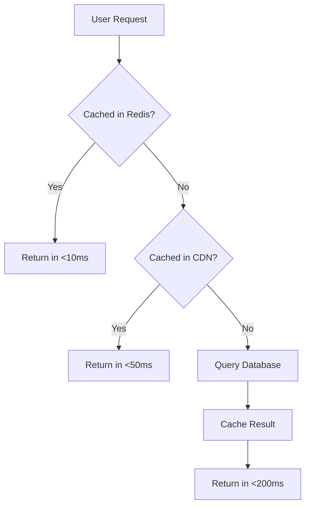

### Monitoring & Alerts

**Key Metrics to Track:**
1. **Error rate** (target: <0.1%)
2. **API latency** (target: p95 < 200ms)
3. **Database CPU** (alert if >80% for 5 min)
4. **AI API failures** (alert if >5% error rate)
5. **Credit balance** (alert instructors at 80%)
6. **Video encoding queue** (alert if >100 jobs pending)

**Alerting Channels:**
- **Critical:** PagerDuty → SMS/call
- **High:** Slack #alerts channel
- **Medium:** Email digest (daily)

---

## Conclusion

Nexus AI Academy is positioned to disrupt the online learning market by combining:

1. **Instructor Empowerment** - Fair revenue share, easy course creation, quality over quantity
2. **Student Experience** - AI-powered personalization, modern UI, flexible pricing
3. **Technical Excellence** - Scalable architecture, fast performance, developer-friendly
4. **Sustainable Economics** - Multiple revenue streams, high margins, aligned incentives

**Next Steps:**
1. ✅ **This Document** - Architecture approved by stakeholders
2. 🔨 **Week 1-4** - Build MVP (auth, course creation, enrollment)
3. 🚀 **Week 5-8** - Launch payments + content features
4. 🤖 **Week 9-12** - Ship AI avatars
5. 📱 **Month 4+** - Mobile app + scale

**Success Metrics (6 Months):**
- 50 active instructors
- 1,000 enrolled students
- 100+ courses published
- $50k+ in gross revenue
- 4.5+ avg course rating
- <2% refund rate

---

**Document Version:** 1.0  
**Last Updated:** February 16, 2026  
**Author:** Nexus AI Academy Team  
**Status:** Ready for Implementation  

---

